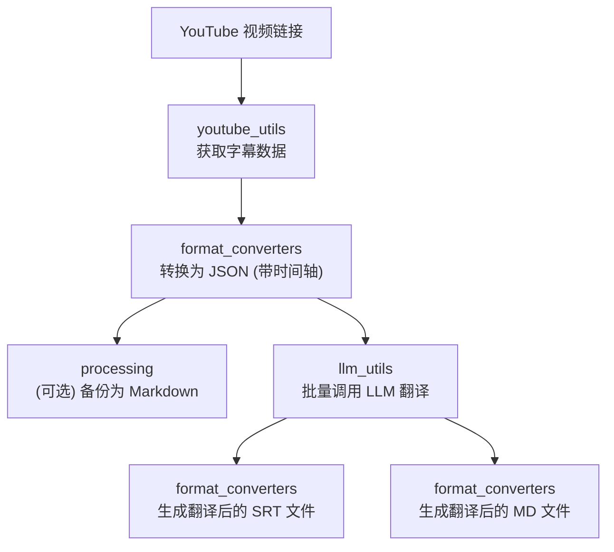

# MultiMediaGenAI 项目

一个利用大语言模型（LLM）实现多媒体内容（如 YouTube 视频、书籍）翻译和格式转换的工具集。本文档旨在作为项目的核心地图和开发指南，帮助开发者快速理解项目结构、定位代码并进行功能迭代。

## 核心功能 (Current Workflow)

当前项目实现了一个完整的工作流，用于翻译指定的 YouTube 视频内容：

- **视频字幕获取**: 自动从指定的 YouTube 视频链接获取原始字幕。
- **格式化与备份**:
    - 将原始字幕转换为带有时间轴的 `.json` 格式，作为后续处理的主要数据源。
    - 同时保存一份原始字幕的 `.md` 文件，用于后续的校对和问题排查。
- **大模型批量翻译**: 将格式化的 JSON 内容分批、大量地发送给大语言模型（LLM）进行翻译。
- **生成翻译稿**:
    - 根据 LLM 返回的翻译结果，生成一份带时间轴的 `.srt` 字幕文件。
    - 同时生成一份易于阅读和校对的 `.md` 格式的翻译文档。

## 工作流详解 (Workflow Diagram)

为了更直观地展示数据流和各模块的协作关系，以下是当前工作流的示意图：



## 近期改进 (Recent Improvements)

- **日志系统重构**: 优化了终端输出，默认只显示核心的工作流进度信息（如"开始"、"获取字幕"、"批次翻译中"等），使得输出更简洁、清晰。所有详细的技术日志（如文件保存、API参数、数据处理细节）都被记录在独立的日志文件中，方便问题排查。
- **性能优化**: 彻底解决了在处理长视频时（数千个字幕片段），因准备翻译批次效率低下而导致的长时间（数十分钟）延迟问题。通过优化批处理算法，准备时间已从分钟级降至秒级。

## 未来规划 (Future Plans)

- **[ ] 书籍翻译功能**: 扩展工作流，支持导入文本文件（如 `.txt`, `.epub`），并进行自动化翻译。
- **[ ] 前端阅读器**: 开发一个简单的前端界面，用于在线查看、对比和修改翻译后的文档。

## 项目结构说明

本项目的代码结构经过精心设计，旨在实现高内聚、低耦合，方便未来进行功能扩展和维护。

- `workflows/`
  - **职责**: **核心工作流编排**。这是项目的入口和业务逻辑层。每个文件代表一个完整的端到端工作流（如 `translate_youtube_video.py`）。如果你想新增一个类似"翻译本地书籍"的功能，就应该在这里创建一个新的工作流文件。

- `youtube_utils/`
  - **职责**: **YouTube 数据获取**。封装了所有与 YouTube API 或第三方库交互的逻辑，如获取视频信息、下载字幕等。

- `llm_utils/`
  - **职责**: **大语言模型交互**。封装了与各种大语言模型（LLM）API的通信逻辑，包括请求的构建、认证、发送和响应解析。`translator.py` 是核心文件。

- `format_converters/`
  - **职责**: **文件格式转换**。负责不同数据格式之间的转换，如 `json` 转 `srt`，`json` 转 `md` 等。该模块不关心数据内容，只负责格式。

- `common_utils/`
  - **职责**: **通用工具库**。存放项目范围内可复用的工具函数，如日志配置 (`log_config.py`)、文件读写助手 (`file_helpers.py`) 等。

## 快速开始 (Quick Start)

### 1. 环境设置

首先，请确保你已经安装了 Python（当前依赖仅能使用Python 3.12.X）。然后，通过以下命令安装项目所需的依赖：

```bash
pip install -r requirements.txt
```
*(注意: `requirements.txt` 文件需要您手动生成，可以使用 `pip freeze > requirements.txt` 命令)*

### 2. 配置

在项目根目录创建一个 `config.py` 文件或者 `.env` 文件，用于存放敏感信息和配置项。一个更完整的 `config.py`示例如下：

```python
# config.py 示例

# LLM 提供商设置
LLM_PROVIDER = "gemini"  # 可选: "gemini", "openai", etc.
LLM_MODEL_GEMINI = "gemini-1.5-flash-preview-0514" # 使用的 Gemini 模型

# API 密钥 (通过 .env 文件加载更安全)
# GEMINI_API_KEY = "your-gemini-api-key"

# 翻译偏好设置
DEFAULT_TARGET_TRANSLATION_LANGUAGE = "zh-CN" # 默认目标翻译语言
PREFERRED_TRANSCRIPT_LANGUAGES = ['en'] # 优先获取的字幕语言列表

# LLM 请求与批处理设置
# 每个翻译批次之间的等待时间（秒）
SECONDS_BETWEEN_BATCHES = 1
# 单个批次可包含的最大字幕片段数量
MAX_SEGMENTS_PER_GEMINI_JSON_BATCH = 100
# 目标单个批次 Prompt 的最大 token 数量 (这是一个估算值)
TARGET_PROMPT_TOKENS_PER_BATCH = 250000
```

### 3. 运行工作流

通过以下命令启动 YouTube 视频翻译工作流：

```bash
python workflows/translate_youtube_video.py --video_url "YOUTUBE_VIDEO_URL_HERE" 
```