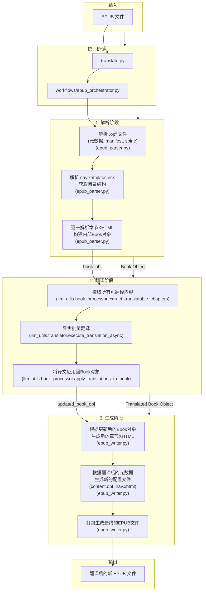
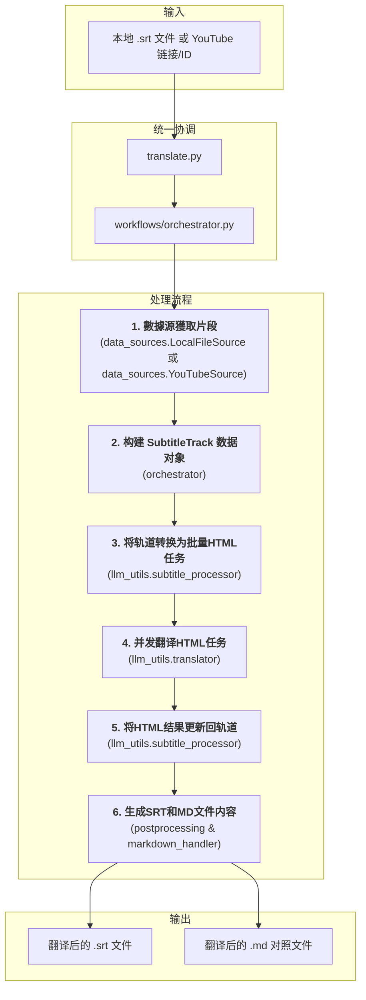

# MultiMediaGenAI: 智能多媒体翻译工具集

一个利用大语言模型（LLM）实现多媒体内容（如EPUB电子书、YouTube视频、本地字幕文件）翻译和格式转换的工具集。

## ✨ 核心功能

- **EPUB 电子书全自动翻译**:
  - **端到端工作流**: 输入一本EPUB电子书，输出一本完整翻译的、保留原格式的EPUB电子书。
  - **深度结构解析**: 精确保留并翻译元数据、多级目录、章节标题、图注、以及复杂的HTML结构。
  - **并发与异步**: 基于 `asyncio` 实现高并发翻译，可通过参数控制并发数，显著提升翻译速度。
  - **配置驱动**: 支持通过外部JSON文件自定义Prompts和术语表（Glossary），以适应不同领域和风格的翻译需求。

- **YouTube 视频翻译**: 
  - 输入一个YouTube视频链接，自动获取官方或自动生成的字幕，并将其翻译成指定语言，生成 `.srt` 文件。

- **本地文件翻译**: 
  - 支持直接翻译本地的 `.srt` 或 `.md` 格式文件。

- **智能文本处理**:
  - **片段智能合并**: 在翻译前将零散的字幕/文本片段合并为完整的句子，提升上下文连貫性。
  - **样式保真**: 在EPUB处理中，精确保留原始的CSS类和HTML标签，确保译文在视觉上与原书高度一致。

## 🚀 快速开始

### 1. 环境设置

首先，请确保您已安装 Python。然后，通过以下命令安装项目所需的依赖：

```bash
pip install -r requirements.txt
```

### 2. 配置 API 密钥

在项目根目录创建一个名为 `.env` 的文件，并添加您的 Gemini API 密钥，格式如下：

```
GEMINI_API_KEY="your-gemini-api-key-here"
```
程序将在翻译模块初始化时自动加载此密钥。

### 3. 运行工作流

#### 运行翻译工作流

所有翻译工作流现在都通过 `translate.py` 作为统一入口点。根据您提供的输入类型（YouTube URL、本地字幕文件或 EPUB 文件），脚本将自动选择并执行相应的工作流。

```bash
python translate.py "YOUR_INPUT_SOURCE" --target_lang "zh-CN" --output_dir "GlobalWorkflowOutputs" [其他可选参数]
```

-   **`YOUR_INPUT_SOURCE`**: (必需) 可以是：
    *   YouTube 视频的 URL (例如: `"https://www.youtube.com/watch?v=dQw4w9WgXcQ"`)
    *   本地 `.srt` 或 `.vtt` 字幕文件的完整路径 (例如: `"/path/to/your/subtitle.srt"`)
    *   本地 `.epub` 电子书文件的完整路径 (例如: `"/path/to/your/book.epub"`)
-   **`--target_lang`**: (可选) 目标翻译语言，默认为 `zh-CN`。
-   **`--output_dir`**: (可选) 所有翻译结果和日志文件的根目录。默认为 `GlobalWorkflowOutputs`。所有生成的文件将保存在此目录下，并按任务（视频标题或文件名）创建子目录。
-   **`--concurrency`**: (可选) 仅适用于 EPUB 翻译工作流。API 请求的并发数，默认为 `10`。
-   **`--prompts`**: (可选) 仅适用于 EPUB 翻译工作流。自定义 Prompts 的 JSON 文件路径。
-   **`--glossary`**: (可选) 仅适用于 EPUB 翻译工作流。自定义术语表的 JSON 文件路径。
-   **`--log_level`**: (可选) 日志级别，默认为 `INFO`。
-   **`--save_llm_logs`**: (可选) 一个布尔标志。如果设置，LLM 原始响应的 JSON 日志文件将在翻译任务**失败时**保存到任务的输出目录中，便于调试和问题排查。

所有生成的文件，包括翻译结果和任务日志，将被保存在 `--output_dir` 指定的目录下，并按视频标题或文件名创建子目录。

## 🔧 工作流详解

本项目的架构实现了核心处理逻辑的模块化。`translate.py` 作为统一入口，根据输入类型分发到不同的 `workflows/` 编排器，而具体的执行逻辑则由 `llm_utils`, `format_converters` 等工具模块提供。

### EPUB 翻译工作流

这是项目当前最完善和强大的工作流，其核心优势在于能够对EPUB进行"无损"翻译。

#### 数据流与核心数据结构

EPUB 翻译工作流的核心数据结构是 `format_converters.book_schema.Book` 对象。

-   **解析阶段**: `data_sources.epub_source.EpubSource` (内部调用 `format_converters.epub_parser.EpubParser`) 负责解析EPUB文件，将元数据、目录结构和每个章节的XHTML内容解析并构建成一个 `Book` 对象。`Book` 对象包含了书的整体结构和所有章节的原始HTML内容。
-   **翻译阶段**:
    -   `llm_utils.book_processor.extract_translatable_chapters` 从 `Book` 对象中提取出所有需要翻译的文本片段，并将其格式化为LLM可处理的“翻译任务”列表。每个任务包含原始文本和其在 `Book` 对象中的位置信息。
    -   `llm_utils.translator.execute_translation_async` 接收这些任务，并负责与LLM进行交互。它使用 `asyncio.Semaphore` 控制并发数（默认为10），以异步方式批量发送翻译请求。
    -   **错误重试**: `llm_utils.translator.py` 内部实现了LLM API调用的重试机制，当遇到API错误或超时时，会进行指数退避重试，确保翻译的稳定性。
    -   LLM返回的翻译结果（通常是HTML片段）会被 `llm_utils.book_processor.apply_translations_to_book` 接收。
-   **结果应用**: `apply_translations_to_book` 根据翻译任务中的位置信息，将LLM返回的译文精确地应用回原始 `Book` 对象中对应的章节内容。这个过程是“就地更新”，确保了翻译内容与原书结构的完美融合。
-   **生成阶段**: `format_converters.epub_writer.book_to_epub` 接收更新后的 `Book` 对象，并将其重新打包成一个新的EPUB文件，包括更新的元数据、目录和翻译后的章节内容。

#### 工作流图



### 统一字幕翻译工作流

所有字幕类工作流（YouTube, 本地SRT文件）现在都通过 `translate.py` 统一入口，并由 `workflows/orchestrator.py` 协调。

#### 数据流与核心数据结构

字幕翻译工作流的核心数据结构是 `format_converters.book_schema.SubtitleTrack` 对象。

-   **数据源获取**: `data_sources.local_file_source.LocalFileSource` 或 `data_sources.youtube_source.YouTubeSource` 获取原始字幕片段，并进行初步的智能合并 (`format_converters.preprocessing.merge_segments_intelligently`)。
-   **数据建模**: `workflows/orchestrator.py` 将这些片段构建成 `SubtitleTrack` 对象。
-   **LLM交互与重试**: `llm_utils.subtitle_processor.subtitle_track_to_html_tasks` 将 `SubtitleTrack` 转换为LLM翻译任务（HTML格式），然后 `llm_utils.translator.execute_translation_async` 进行并发翻译。`llm_utils.translator.py` 内部包含API调用重试机制。此外，`orchestrator.py` 在工作流层面也实现了对未翻译或翻译失败片段的多次重试，以提高翻译成功率。
-   **结果应用**: `llm_utils.subtitle_processor.update_track_from_html_response` 将LLM返回的翻译结果（HTML）解析并精确地更新回 `SubtitleTrack` 对象。
-   **后处理与生成**: 最终，`format_converters.postprocessing.generate_post_processed_srt` 和 `format_converters.markdown_handler.reconstruct_translated_markdown` 使用完整的 `SubtitleTrack` 对象生成最终的 `.srt` 和 `.md` 文件。

更详细的工作流说明请参阅 [统一字幕翻译工作流文档](docs/subtitle_translation_workflow.md)。

#### 工作流图



## 📂 项目结构

- `workflows/`: **核心工作流编排**。项目的入口，每个文件代表一个完整的端到端任务。
- `llm_utils/`: **大语言模型交互**。封装了与LLM API的通信、Prompt构建、并发控制等逻辑。
- `format_converters/`: **数据转换与处理**。负责文件的解析（EPUB, SRT）、文本的预处理和后处理。
- `youtube_utils/`: **YouTube数据获取**。封装了所有与YouTube相关的下载和处理逻辑。
- `common_utils/`: **通用工具库**。存放项目通用的辅助函数（如日志、文件操作），包括 `output_manager.py` 用于统一管理输出。
- `GlobalWorkflowOutputs/`: **默认输出目录**。所有翻译结果和任务日志的默认存放位置。
- `docs/`: **详细设计文档**。存放对主要工作流的详细设计和模块说明。

## ℹ️ 深入了解

本项目更详细的设计文档、模块功能说明和工作流原理保存在 `docs/` 目录下。推荐在进行二次开发或深入研究前阅读这些文档。