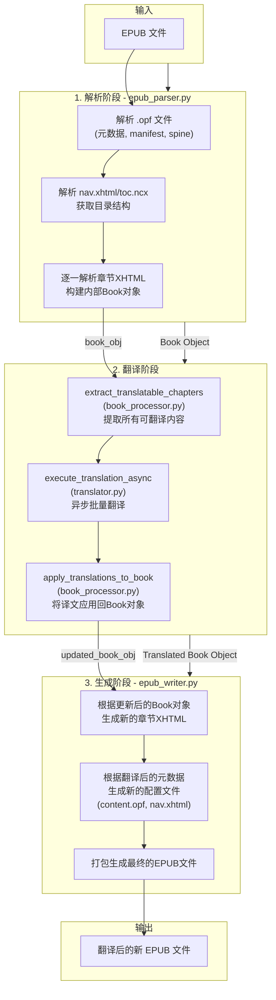
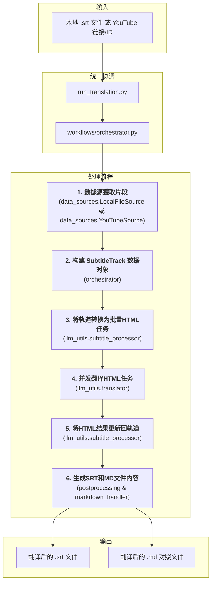

# MultiMediaGenAI: 智能多媒体翻译工具集

一个利用大语言模型（LLM）实现多媒体内容（如EPUB电子书、YouTube视频、本地字幕文件）翻译和格式转换的工具集。

## ✨ 核心功能

- **EPUB 电子书全自动翻译**:
  - **端到端工作流**: 输入一本EPUB电子书，输出一本完整翻译的、保留原格式的EPUB电子书。
  - **深度结构解析**: 精确保留并翻译元数据、多级目录、章节标题、图注、以及复杂的HTML结构。
  - **并发与异步**: 基于 `asyncio` 实现高并发翻译，可通过参数控制并发数，显著提升翻译速度。
  - **配置驱动**: 支持通过外部JSON文件自定义Prompts和术语表（Glossary），以适应不同领域和风格的翻译需求。

- **YouTube 视频翻译**: 
  - 输入一个YouTube视频链接，自动获取官方或自动生成的字幕，并将其翻译成指定语言，生成 `.srt` 文件。

- **本地文件翻译**: 
  - 支持直接翻译本地的 `.srt` 或 `.md` 格式文件。

- **智能文本处理**:
  - **片段智能合并**: 在翻译前将零散的字幕/文本片段合并为完整的句子，提升上下文连貫性。
  - **样式保真**: 在EPUB处理中，精确保留原始的CSS类和HTML标签，确保译文在视觉上与原书高度一致。

## 🚀 快速开始

### 1. 环境设置

首先，请确保您已安装 Python。然后，通过以下命令安装项目所需的依赖：

```bash
pip install -r requirements.txt
```

### 2. 配置 API 密钥

在项目根目录创建一个名为 `.env` 的文件，并添加您的 Gemini API 密钥，格式如下：

```
GEMINI_API_KEY="your-gemini-api-key-here"
```
程序将在翻译模块初始化时自动加载此密钥。

### 3. 运行工作流

#### 翻译 EPUB 电子书 (主要工作流)

```bash
python workflows/translate_epub.py "/path/to/your/book.epub" --target_lang "zh-CN" --concurrency 10
```
- **`epub_path`**: (必需) 本地 `.epub` 文件的完整路径。
- **`--target_lang`**: (可选) 目标翻译语言，默认为 `zh-CN`。
- **`--concurrency`**: (可选) API请求的并发数，默认为 `10`。
- **`--prompts`**: (可选) 自定义 Prompts 的JSON文件路径。
- **`--glossary`**: (可选) 自定义术语表的JSON文件路径。


#### 翻译字幕 (YouTube 视频或本地 SRT 文件)

```bash
python run_translation.py "YOUTUBE_VIDEO_URL_OR_LOCAL_SRT_PATH" --target_lang "zh-CN"
```

- **`YOUTUBE_VIDEO_URL_OR_LOCAL_SRT_PATH`**: (必需) 可以是 YouTube 视频的 URL 或本地 `.srt` 文件的完整路径。
- **`--target_lang`**: (可选) 目标翻译语言，默认为 `zh-CN`。
- **`--output_dir`**: (可选) 输出文件的根目录，默认为 `GlobalWorkflowOutputs`。
- **`--log_level`**: (可选) 日志级别，默认为 `INFO`。

所有生成的文件，包括翻译结果和任务日志，将被保存在 `GlobalWorkflowOutputs` 目录下，并按视频标题或文件名创建子目录。

## 🔧 工作流详解

本项目的架构实现了核心处理逻辑的模块化。`workflows/` 目录下的 `orchestrator.py` 脚本负责编排任务，而具体的执行逻辑则由 `llm_utils`, `format_converters` 等工具模块提供。

### EPUB 翻译工作流

这是项目当前最完善和强大的工作流，其核心优势在于能够对EPUB进行"无损"翻译。



### 统一字幕翻译工作流

所有字幕类工作流（YouTube, 本地SRT文件）现在都通过 `run_translation.py` 统一入口，并由 `workflows/orchestrator.py` 协调。更详细的工作流说明请参阅 [统一字幕翻译工作流文档](docs/subtitle_translation_workflow.md)。



## 📂 项目结构

- `workflows/`: **核心工作流编排**。项目的入口，每个文件代表一个完整的端到端任务。
- `llm_utils/`: **大语言模型交互**。封装了与LLM API的通信、Prompt构建、并发控制等逻辑。
- `format_converters/`: **数据转换与处理**。负责文件的解析（EPUB, SRT）、文本的预处理和后处理。
- `youtube_utils/`: **YouTube数据获取**。封装了所有与YouTube相关的下载和处理逻辑。
- `common_utils/`: **通用工具库**。存放项目通用的辅助函数（如日志、文件操作）。
- `outputs/`: **输出目录**。用于存放日志等生成文件（默认行为是在源文件目录生成结果）。
- `docs/`: **详细设计文档**。存放对主要工作流的详细设计和模块说明。

## ℹ️ 深入了解

本项目更详细的设计文档、模块功能说明和工作流原理保存在 `docs/` 目录下。推荐在进行二次开发或深入研究前阅读这些文档。
