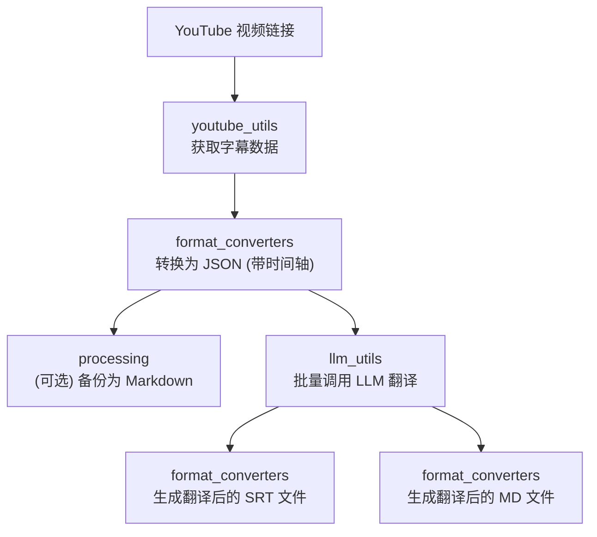

# MultiMediaGenAI 项目

一个利用大语言模型（LLM）实现多媒体内容（如 YouTube 视频、书籍）翻译和格式转换的工具集。本文档旨在作为项目的核心地图和开发指南，帮助开发者快速理解项目结构、定位代码并进行功能迭代。

## 核心功能 (Current Workflow)

当前项目实现了一个完整的工作流，用于翻译指定的 YouTube 视频内容：

- **视频字幕获取**: 自动从指定的 YouTube 视频链接获取原始字幕。
- **格式化与备份**:
    - 将原始字幕转换为带有时间轴的 `.json` 格式，作为后续处理的主要数据源。
    - 同时保存一份原始字幕的 `.md` 文件，用于后续的校对和问题排查。
- **大模型批量翻译**: 将格式化的 JSON 内容分批、大量地发送给大语言模型（LLM）进行翻译。
- **生成翻译稿**:
    - 根据 LLM 返回的翻译结果，生成一份带时间轴的 `.srt` 字幕文件。
    - 同时生成一份易于阅读和校对的 `.md` 格式的翻译文档。

## 工作流详解 (Workflow Diagram)

为了更直观地展示数据流和各模块的协作关系，以下是当前工作流的示意图：



## 近期改进 (Recent Improvements)

- **日志系统重构**: 优化了终端输出，默认只显示核心的工作流进度信息（如"开始"、"获取字幕"、"批次翻译中"等），使得输出更简洁、清晰。所有详细的技术日志（如文件保存、API参数、数据处理细节）都被记录在独立的日志文件中，方便问题排查。
- **性能优化**: 彻底解决了在处理长视频时（数千个字幕片段），因准备翻译批次效率低下而导致的长时间（数十分钟）延迟问题。通过优化批处理算法，准备时间已从分钟级降至秒级。

## 未来规划 (Future Plans)

- **[ ] 书籍翻译功能**: 扩展工作流，支持导入文本文件（如 `.txt`, `.epub`），并进行自动化翻译。
- **[ ] 前端阅读器**: 开发一个简单的前端界面，用于在线查看、对比和修改翻译后的文档。

## 新增功能：本地字幕文件翻译

除了翻译在线YouTube视频，项目现在支持直接翻译本地的 `.srt` 字幕文件。

- **工作流**: `workflows/translate_from_file.py`
- **核心流程**:
    1.  **读取与解析**: 直接读取本地 `.srt` 文件，并将其解析为内部统一的数据结构。
    2.  **预处理与合并**: 为了提升翻译质量，程序会智能地合并时间上连续的、语义上相关的短字幕段，形成更完整的长句。
    3.  **批量翻译**: 将合并后的长句发送给大语言模型进行翻译。
    4.  **后处理与拆分**: 将翻译好的长句，根据原文的对话节奏（`-`符号）和句末标点（`。` `！` `？`），智能地拆分成多个时间精准、符合阅读习惯的短字幕段。
    5.  **生成文件**: 输出最终的、经过精排版的 `.srt` 翻译文件。
- **质量监控**:
    - **段落数校验**: 严格确保发送给大模型翻译的段落数与收回的段落数完全一致。
    - **时长校验**: 严格确保经过复杂的合并与拆分后，最终输出的字幕总有效时长与原文的总有效时长保持一致（允许有<1ms的浮点误差），杜绝音画不同步问题。

```mermaid
graph TD;
    subgraph 新增工作流：本地文件翻译
        H["本地 .srt 文件"] --> I["format_converters<br/>解析并合并字幕<br/>(预处理)"];
        I --> J["llm_utils<br/>批量调用 LLM 翻译"];
        J --> K["format_converters<br/>拆分并重定时<br/>(后处理)"];
        K --> L["format_converters<br/>生成翻译后的 SRT 文件"];
    end
```

## 已知权衡与待改进 (Known Trade-offs & Future Improvements)

### 时间轴精度的权衡

为了获得更高质量、更流畅的翻译结果，我们采用了"先合并，后拆分"的策略。即将多个原始的、零碎的字幕段合并成长句送去翻译，再将翻译结果根据语义拆分回多个字幕段。

- **当前实现**: 在拆分翻译结果并重新分配时间时，我们是根据译文的**字符数比例**来进行的。
- **带来的"遗憾"**: 这个过程**丢失了原始字幕的精确分割点信息**。例如，如果原文是两个独立的、中间有1秒空隙的字幕块，在合并再拆分后，这个1秒的空隙可能会消失，导致拆分后的两个新字幕块在时间上是紧密相连的。这会造成与原始时间轴**亚秒级的微小偏差**。
- **结论**: 这是我们为了追求**翻译质量**而在**时间轴绝对精度**上做出的一个明确的、有意识的权衡。对于大多数观看场景，这种微小的偏差几乎不会被察觉，但对于专业级的视频制作，这可能是一个需要被感知的点。

- **未来可能的改进方向**:
    - **方案一 (保留分割点信息)**: 在合并字幕时，将原始的分割点时间戳作为一种特殊的元数据保留下来。在后处理拆分时，优先使用这些元数据来恢复原始的时间轴，而不是完全依赖比例计算。这在技术上更复杂，但能实现两全其美。
    - **方案二 (提供选项)**: 在工作流的命令行参数中提供一个开关，如 `--preserve-timing`。当用户激活此开关时，程序将完全跳过合并与拆分的步骤，以牺牲部分翻译质量为代价，换取100%无损的时间轴。

## 项目结构说明

本项目的代码结构经过精心设计，旨在实现高内聚、低耦合，方便未来进行功能扩展和维护。

- `workflows/`
  - **职责**: **核心工作流编排**。这是项目的入口和业务逻辑层。每个文件代表一个完整的端到端工作流（如 `translate_youtube_video.py` 或 `translate_from_file.py`）。如果你想新增一个类似"翻译本地书籍"的功能，就应该在这里创建一个新的工作流文件。

- `youtube_utils/`
  - **职责**: **YouTube 数据获取**。封装了所有与 YouTube API 或第三方库交互的逻辑，如获取视频信息、下载字幕等。此模块仅用于与YouTube相关的工作流。

- `llm_utils/`
  - **职责**: **大语言模型交互**。封装了与各种大语言模型（LLM）API的通信逻辑，包括构建提示词、认证、分批发送和响应解析。`translator.py` 是核心文件。

- `format_converters/`
  - **职责**: **数据转换与处理**。负责各种数据格式的核心处理逻辑。这**不仅包括**文件格式的转换（如 `json` 转 `srt`），**更关键的是**，它还包含了工作流中的核心数据处理步骤：
      - **解析 (Parsing)**: 从原始格式（如 `.srt`）读取数据并转换为内部结构。
      - **预处理 (Pre-processing)**: 为了优化翻译而进行的字幕合并。
      - **后处理 (Post-processing)**: 将翻译结果根据语义和时间戳进行智能拆分和精排。
      - **生成 (Generation)**: 将最终数据写入目标文件格式（如 `.srt`, `.md`）。

- `common_utils/`
  - **职责**: **通用工具库**。存放项目范围内可复用的、与具体业务逻辑无关的工具函数。
      - `log_config.py`: 日志系统配置。
      - `file_helpers.py`: 文件读写助手。
      - `time_utils.py`: 时间格式化与计算相关的工具函数。

## 快速开始 (Quick Start)

### 1. 环境设置

首先，请确保你已经安装了 Python（当前依赖仅能使用Python 3.12.X）。然后，通过以下命令安装项目所需的依赖：

```bash
pip install -r requirements.txt
```
*(注意: `requirements.txt` 文件需要您手动生成，可以使用 `pip freeze > requirements.txt` 命令)*

### 2. 配置

在项目根目录创建一个 `config.py` 文件或者 `.env` 文件，用于存放敏感信息和配置项。一个更完整的 `config.py`示例如下：

```python
# config.py 示例

# LLM 提供商设置
LLM_PROVIDER = "gemini"  # 可选: "gemini", "openai", etc.
LLM_MODEL_GEMINI = "gemini-1.5-flash-preview-0514" # 使用的 Gemini 模型

# API 密钥 (通过 .env 文件加载更安全)
# GEMINI_API_KEY = "your-gemini-api-key"

# 翻译偏好设置
DEFAULT_TARGET_TRANSLATION_LANGUAGE = "zh-CN" # 默认目标翻译语言
PREFERRED_TRANSCRIPT_LANGUAGES = ['en'] # 优先获取的字幕语言列表

# LLM 请求与批处理设置
# 每个翻译批次之间的等待时间（秒）
SECONDS_BETWEEN_BATCHES = 1
# 单个批次可包含的最大字幕片段数量
MAX_SEGMENTS_PER_GEMINI_JSON_BATCH = 100
# 目标单个批次 Prompt 的最大 token 数量 (这是一个估算值)
TARGET_PROMPT_TOKENS_PER_BATCH = 250000
```

### 3. 运行工作流

通过以下命令启动 YouTube 视频翻译工作流：

```bash
python workflows/translate_youtube_video.py "YOUTUBE_VIDEO_URL_HERE"
```

通过以下命令启动本地 `.srt` 文件翻译工作流：

```bash
python workflows/translate_from_file.py "/path/to/your/subtitle_file.srt"
```