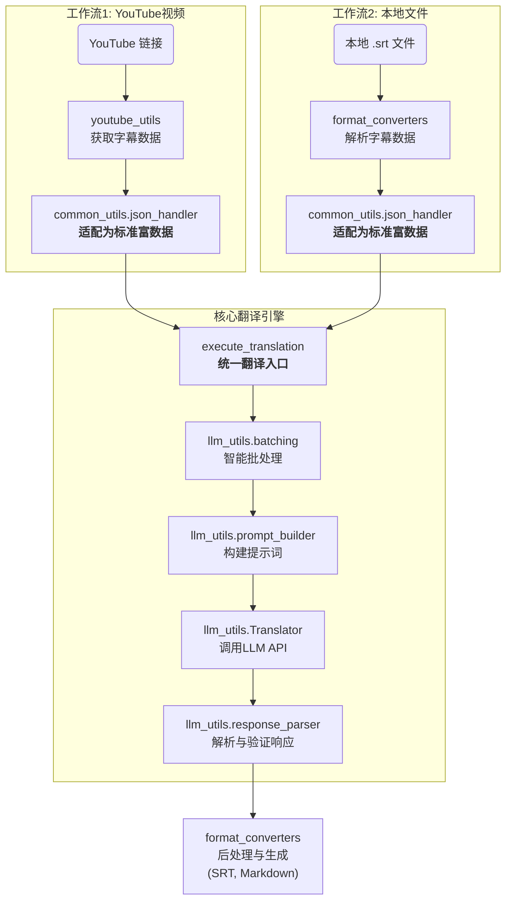

# MultiMediaGenAI 项目

一个利用大语言模型（LLM）实现多媒体内容（如 YouTube 视频、本地字幕文件）翻译和格式转换的工具集。

## 核心功能

- **YouTube 视频翻译**: 输入一个YouTube视频链接，自动获取官方字幕或自动生成的字幕，并将其翻译成指定语言。
- **本地文件翻译**: 支持直接翻译本地的 `.srt` 字幕文件，同时保留原始时间轴信息。
- **模块化与可扩展**: 项目采用高内聚、低耦合的模块化设计，方便未来扩展新的功能和工作流。
- **高质量翻译策略**: 通过"预合并-翻译-后拆分"的智能处理流程，在保证时间轴基本准确的前提下，获得更连贯、更符合上下文的翻译质量。

## 架构与工作流

本项目的架构遵循"编排与执行分离"的原则。`workflows/` 目录下的脚本负责定义和编排特定任务（如"翻译一个YouTube视频"）的步骤，而具体的执行逻辑则由可复用的工具模块（如 `llm_utils`, `common_utils`）提供。

所有工作流共享一个统一的翻译入口：`llm_utils.translator.execute_translation` 函数。该函数封装了与大语言模型交互的所有复杂性，包括批处理、构建提示、调用API、解析结果和执行数据完整性检查。

工作流的核心流程如下：
1. **数据准备**: 工作流脚本调用 `youtube_utils` 或 `format_converters` 来获取源数据。
2. **格式适配**: 使用 `common_utils.json_handler` 将源数据转换为统一的"富数据格式"。
3. **执行翻译**: 将适配后的数据交给 `execute_translation` 函数进行翻译。
4. **生成输出**: 使用 `format_converters` 将翻译结果重构为最终的 `.srt` 或 `.md` 文件。



## 项目结构说明

- `workflows/`: **核心工作流编排**。项目的入口，每个文件代表一个完整的端到端任务。
- `llm_utils/`: **大语言模型交互**。封装了与LLM API的通信逻辑。
  - `translator.py`: 包含统一的 `Translator` 核心翻译类。
  - `prompt_builder.py`: 负责构建发送给LLM的详细指令。
  - `batching.py`: 负责将大量文本智能地拆分为适合API处理的批次。
  - `response_parser.py`: 负责解析和验证LLM返回的结果，确保数据质量。
- `youtube_utils/`: **YouTube数据获取**。封装了所有与YouTube相关的下载逻辑。
- `format_converters/`: **数据转换与处理**。负责文件的解析、字幕的预处理（合并）、后处理（拆分）和最终文件的生成。
- `common_utils/`: **通用工具库**。存放项目通用的辅助函数。
  - `json_handler.py`: **包含关键的数据适配器 `create_pre_translate_json_objects`**。


## 快速开始 (Quick Start)

### 1. 环境设置

首先，请确保您已安装 Python。然后，通过以下命令安装项目所需的依赖：

```bash
pip install -r requirements.txt
```
*(注意: 如果 `requirements.txt` 文件不存在或过时，您可以使用 `pip freeze > requirements.txt` 命令生成)*

### 2. 配置 API 密钥

在项目根目录创建一个名为 `.env` 的文件，并添加您的 Gemini API 密钥，格式如下：

```
GEMINI_API_KEY="your-gemini-api-key-here"
```

### 3. 运行工作流

#### 翻译 YouTube 视频

```bash
python workflows/translate_youtube_video.py "YOUTUBE_VIDEO_URL_OR_ID" --target_lang "zh-CN"
```
- **`video_url_or_id`**: (必需) YouTube视频的完整URL或视频ID。
- **`--target_lang`**: (可选) 目标翻译语言，默认为 `zh-CN`。

#### 翻译本地 SRT 文件

```bash
python workflows/translate_from_file.py "/path/to/your/subtitle.srt" --target_lang "zh-CN"
```
- **`file_path`**: (必需) 本地 `.srt` 字幕文件的完整路径。
- **`--target_lang`**: (可选) 目标翻译语言，默认为 `zh-CN`。


所有生成的文件，包括日志和翻译结果，将被保存在项目目录外的一个名为 `GlobalWorkflowOutputs` 的文件夹中，并以视频标题或文件名分类存放。

## 已知问题与处理

### YouTube 字幕中的负时长 (Negative Duration)

- **问题现象**: 在处理某些YouTube视频时，日志中可能会出现关于"负时长" (`Negative duration detected`) 的警告。
- **根本原因**: 这是由于 YouTube 的自动语音识别 (ASR) 系统在生成字幕时，可能产生微小的时间戳误差，导致某个字幕片段的计算出的结束时间早于其开始时间。这属于上游数据源的固有问题。
- **处理策略**:
  - **旧版行为**: 直接丢弃这些存在时间戳问题的字幕片段，导致翻译内容丢失。
  - **当前修复**: 在 `youtube_utils/data_fetcher.py` 的 `preprocess_and_merge_segments` 函数中，我们不再丢弃这些片段。而是将它们的**时长修正为0**，并保留其文本内容。
- **结果**: 这样可以确保即使源数据存在微瑕，也不会丢失任何需要翻译的文本内容，保证了翻译的完整性。虽然在生成的SRT文件中，这些片段会成为"零时长"字幕（一闪而过），但这远优于丢失整句内容。