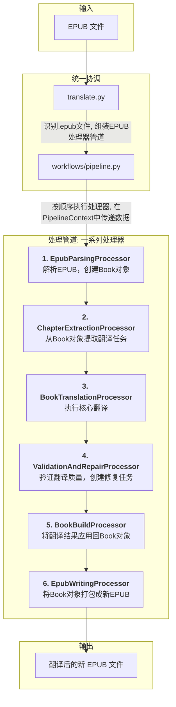

# 文档: EPUB 翻译工作流

本文档详细描述了 `MultiMediaGenAI` 项目中用于翻译 EPUB 电子书的端到端工作流。

- **执行入口**: `translate.py`
- **核心架构**: 基于"管道-处理器"模式 (`Pipeline-Processor`)
- **核心目标**: 输入一个 `.epub` 文件，输出一个内容被完整翻译、同时保持原始结构和样式的新的 `.epub` 文件。

---

## 工作流架构

该工作流基于一个异步的 `Pipeline`（管道）执行器，它按顺序调用一系列专门的 `Processor`（处理器）。每个处理器完成一步特定的任务，并在一个统一的 `PipelineContext`（上下文）对象中接收输入和存入输出。这种设计确保了流程的高度模块化、可测试性和可扩展性。

---

## 数据流转与核心数据结构

EPUB 翻译工作流的核心数据载体是 `workflows.dto.PipelineContext` 对象。所有数据和状态都在这个上下文中，由不同的处理器进行创建、转换和更新。

-   **初始化**: `translate.py` 脚本接收命令行参数，并创建一个 `PipelineContext` 实例，填入初始信息如 `source_input` (文件路径), `target_lang` 等。
-   **解析 (`EpubParsingProcessor`)**: 此处理器从上下文中读取 `source_input`，解析EPUB文件，然后将生成的 `Book` 对象（一个包含了 `mmg_id` 的核心数据结构）存回上下文的 `original_book` 字段。
-   **翻译任务提取 (`ChapterExtractionProcessor`)**: 此处理器从上下文的 `original_book` 中提取所有需要翻译的文本片段，并将格式化后的"翻译任务"列表存入上下文的 `translation_tasks` 字段。
-   **第一轮翻译 (`BookTranslationProcessor`)**: 此处理器读取 `translation_tasks`，调用LLM进行翻译，并将初步的翻译结果存入 `translated_results` 字段。
-   **验证与修复 (`ValidationAndRepairProcessor`)**: 这是提升翻译质量的关键步骤。此处理器会对比 `original_book` 和 `translated_results`。它通过 `mmg_id` 识别出可能被"漏翻"的内容块，并将它们打包成一个新的"修复任务"列表，存入 `repair_tasks` 字段。
-   **第二轮翻译 (`BookTranslationProcessor` - 内部逻辑)**: 如果 `repair_tasks` 不为空，`BookTranslationProcessor` 会再次被隐式调用（或其内部有循环逻辑）来处理修复任务，并将修复结果追加到 `translated_results`。
-   **结果应用 (`BookBuildProcessor`)**: 此处理器接收 `original_book` 和完整的 `translated_results`。它将所有翻译结果（无论是初翻还是修复的）精确地应用回 `Book` 对象的深拷贝中，并将这个最终的 `Book` 对象存入 `translated_book` 字段。
-   **输出 (`EpubWritingProcessor`)**: 此处理器读取 `translated_book`，并将其重新打包成一个新的EPUB文件，写入到 `output_dir` 指定的位置。

---

## 模块化处理器详解

### 1. `EpubParsingProcessor`

- **核心职责**: 解析原始EPUB文件，构建 `Book` 对象。
- **输入 (来自 `PipelineContext`)**: `source_input` (EPUB文件路径)。
- **输出 (写入 `PipelineContext`)**: `original_book` (`Book` 对象)。

**任务与逻辑**:
1.  该处理器是管道的起点，负责将文件系统中的 `.epub` 文件转换为内存中的标准化数据结构。
2.  它会解压 EPUB 文件，深度解析其包文件 (`.opf`)、导航文件 (`nav.xhtml`) 以及所有内容文档 (XHTML)。
3.  **核心逻辑**: 在解析HTML内容为内部块结构时，为每一个内容块（如段落、标题、列表项等）分配一个唯一的、稳定的 `mmg_id` 属性。
4.  最终将所有信息封装到一个 `Book` 对象中，存入上下文，供后续处理器使用。

**关键内部实现**:
- `data_sources.epub_source.EpubSource`: 处理器通过实例化此类来启动解析。
- `EpubSource.get_book()`: 这是获取 `Book` 对象的主方法。
- `format_converters.epub_parser.EpubParser`: 在 `get_book()` 内部被调用，执行最核心、最复杂的EPUB文件解析和 `mmg_id` 分配工作。

### 2. `ChapterExtractionProcessor`

- **核心职责**: 从 `Book` 对象中提取所有可翻译内容，并准备成LLM任务。
- **输入 (来自 `PipelineContext`)**: `original_book`。
- **输出 (写入 `PipelineContext`)**: `translation_tasks` (翻译任务列表)。

**任务与逻辑**:
1.  接收第一步生成的、已带有 `mmg_id` 的 `Book` 对象。
2.  遍历所有章节内容，将其序列化为HTML字符串。在此过程中，`mmg_id` 会被转换为HTML标签的 `data-mmg-id` 属性。
3.  为了提升效率，此处理器会将内容过长的章节拆分为多个部分（`split_part`），或将多个内容较短的小章节打包成一个批处理任务（`json_batch`）。
4.  最终生成一个"翻译任务"列表，每个任务都包含了附有 `data-mmg-id` 的HTML内容，为后续的精确修复打下基础。

**关键内部实现**:
- `llm_utils.book_processor.extract_translatable_chapters`: 处理器直接调用此核心函数，该函数封装了所有内容提取、智能拆分大章节和打包小章节的复杂逻辑。

### 3. `BookTranslationProcessor`

- **核心职责**: 执行核心翻译，并能处理修复任务。
- **输入 (来自 `PipelineContext`)**: `translation_tasks`, `repair_tasks` (可选)。
- **输出 (写入 `PipelineContext`)**: `translated_results`。

**任务与逻辑**:
这是一个可被多次利用的、高度复用的翻译服务。

1.  **第一轮 (Initial Translation)**: 接收 `translation_tasks` 生成的全部任务列表，进行全面的初步翻译。
2.  **第二轮 (Repair Translation)**: (可选) 如果 `ValidationAndRepairProcessor` 发现了漏翻内容并填充了 `repair_tasks`，此处理器（或其后续逻辑）会被再次调用，仅针对漏翻的内容进行二次翻译。
3.  **并发与重试**: 内部使用 `asyncio.Semaphore` 管理并发API请求，并内置了指数退避重试机制，以确保调用的稳定性和鲁棒性。
4.  **Prompt 处理**: 根据任务类型（`json_batch`, `split_part`, `fix_batch`），从 `prompts.json` 加载并构建相应的指令。

**关键内部实现**:
- `llm_utils.translator.execute_translation_async`: 处理器调用此异步函数来与LLM API进行交互。该函数负责管理并发、处理重试、构建Prompts，并返回翻译结果。

### 3.5 `ValidationAndRepairProcessor`

- **核心职责**: 在初翻后进行质量校验，并提取需要修复的任务。
- **输入 (来自 `PipelineContext`)**: `original_book`, `translated_results` (初翻结果)。
- **输出 (写入 `PipelineContext`)**: `repair_tasks`。

**任务与逻辑**:
1.  在第一轮翻译后被调用。
2.  **核心逻辑**: 遍历 `translated_results`，将翻译后的HTML解析回临时的内容块。然后通过 `mmg_id` 在 `original_book` 中找到对应的原始块。
3.  通过对比翻译后块的纯文本和原始块的纯文本，判断是否存在"漏翻"（即两者文本完全相同）。
4.  将所有被识别为漏翻的原始块收集起来，打包成一个新的、类型为 `fix_batch` 的翻译任务，并存入 `repair_tasks` 字段。
5.  如果未发现漏翻，则 `repair_tasks` 保持为空。

**关键内部实现**:
- `llm_utils.book_processor.validate_and_extract_fixes`: 处理器直接调用此核心函数。该函数通过 `mmg_id` 在原始 `Book` 对象和翻译结果之间进行精确匹配和对比，并负责生成修复任务。

### 4. `BookBuildProcessor`

- **核心职责**: 将所有翻译结果智能地应用回 `Book` 对象。
- **输入 (来自 `PipelineContext`)**: `original_book`, `translated_results` (合并后的最终结果)。
- **输出 (写入 `PipelineContext`)**: `translated_book`。

**任务与逻辑**:
1.  接收原始的 `Book` 对象和**合并后**的翻译结果列表（包含初翻结果和可能的修复结果）。
2.  创建一个 `Book` 对象的深拷贝，生成 `translated_book`，以确保所有修改都在一个新的对象上进行。
3.  **智能分发与精确替换**: 遍历所有翻译结果，利用 `mmg_id` 作为关键，在 `translated_book` 中找到需要被更新的旧块，并用翻译后的新块将其精确替换。
4.  **后处理**: 进行全局的标题提取和目录（ToC）修正，确保目录链接文本与最终翻译的章节标题一致。
5.  返回一个内容已被完全翻译和修复的 `translated_book` 对象。

**关键内部实现**:
- **修复翻译**: `llm_utils.translator.execute_translation_async`: 如果检测到 `repair_tasks`，处理器会首先调用此函数完成修复翻译。
- **结果应用**: `llm_utils.book_processor.apply_translations_to_book`: 处理器调用此核心函数，将初翻和修复后的所有结果合并，并智能地应用回一个新的 `Book` 对象中。

### 5. `EpubWritingProcessor`

- **核心职责**: 将内存中的 `Book` 对象写回为 `.epub` 文件。
- **输入 (来自 `PipelineContext`)**: `translated_book`, `output_dir`。
- **输出**: 在文件系统生成最终的 `.epub` 文件。

**任务与逻辑**:
1.  接收最终翻译和修复完成的 `translated_book` 对象。
2.  **核心职责**: 将内容块列表转换回HTML字符串。在此过程中，`data-mmg-id` 属性也会被写回到最终的XHTML文件中，便于调试。
3.  在临时目录中重建EPUB的文件结构，写入所有翻译后的XHTML章节、新的元数据文件 (`.opf`)、新的导航文件 (`nav.xhtml`)以及所有资源（图片、CSS）。
4.  最后，将所有文件打包压缩，生成最终的、可供阅读的 `.epub` 文件。

**关键内部实现**:
- `common_utils.output_manager.OutputManager`: 用于创建和管理工作流的输出目录。
- `format_converters.epub_writer.book_to_epub`: 处理器调用此核心函数，该函数负责将 `Book` 对象序列化为EPUB文件结构，并最终打包成 `.epub` 文件。
