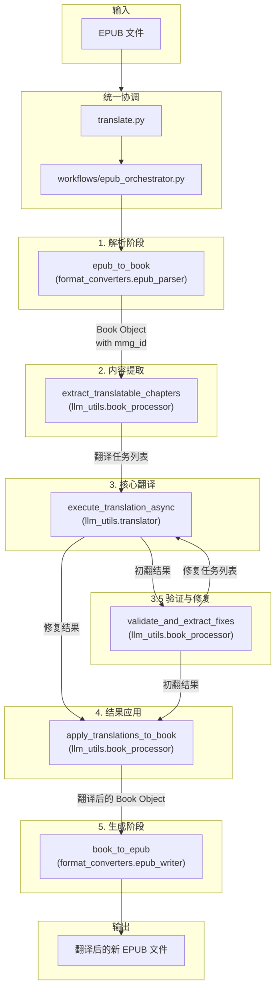

# 文档: EPUB 翻译工作流

本文档详细描述了 `MultiMediaGenAI` 项目中用于翻译 EPUB 电子书的端到端工作流。

- **执行入口**: `translate.py`
- **核心目标**: 输入一个 `.epub` 文件，输出一个内容被完整翻译、同时保持原始结构和样式的新的 `.epub` 文件。

---

## 工作流架构

该工作流基于 `asyncio` 实现，以确保在处理大量翻译任务时的高性能。整个流程被精心设计为一系列可独立测试和维护的模块化步骤，并包含一个自动化的验证和修复阶段，以提高翻译质量。

---

## 数据流转与核心数据结构

EPUB 翻译工作流的核心数据结构是 `format_converters.book_schema.Book` 对象。所有数据在不同阶段都围绕此对象进行转换和更新。

-   **输入与解析**: 原始EPUB文件通过 `data_sources.epub_source.EpubSource` 解析成一个 `Book` 对象。在此阶段，`html_mapper` 会为每一个内容块（如段落、标题）分配一个唯一的、稳定的 `mmg_id` 属性。
-   **翻译任务提取**: `llm_utils.book_processor.extract_translatable_chapters` 从 `Book` 对象中提取所有需要翻译的文本片段，并将其格式化为LLM可处理的"翻译任务"列表。这些任务的HTML内容中完整保留了 `data-mmg-id` 属性。
-   **第一轮翻译（初翻）**: `llm_utils.translator.execute_translation_async` 接收任务列表，并发地调用LLM API进行翻译，返回初步的翻译结果。
-   **验证与修复**: 这是提升翻译质量的关键步骤。`llm_utils.book_processor.validate_and_extract_fixes` 函数会对比初翻结果和原文。它通过 `mmg_id` 识别出那些可能被LLM"漏翻"（即译文与原文完全相同）的内容块，并将它们打包成一个新的"修复任务"列表。
-   **第二轮翻译（修复）**: 如果存在修复任务，`workflows/epub_orchestrator.py` 会再次调用 `execute_translation_async`，仅针对漏翻的内容进行第二次翻译。
-   **结果应用**: `llm_utils.book_processor.apply_translations_to_book` 接收**合并后**的最终结果（包含初翻和修复结果）。它通过 `mmg_id` 将每一条翻译结果（无论是初翻还是修复的）精确地应用回 `Book` 对象的深拷贝中。
-   **输出阶段**: 最终，更新后的 `Book` 对象通过 `format_converters.epub_writer.book_to_epub` 重新打包成一个新的EPUB文件。

---

## 模块化步骤详解

### 1. 解析阶段 (Parsing)

- **主控脚本**: `translate.py` (通过 `workflows/epub_orchestrator.py` 协调)
- **核心模块**: `format_converters.epub_parser`, `format_converters.html_mapper`
- **核心函数**: `epub_to_book(epub_path)`

**任务与职责**:
1.  该函数接收 EPUB 文件的路径作为输入。
2.  在内部，它会解压 EPUB 文件，并深度解析其包文件 (`.opf`)、导航文件 (`nav.xhtml`) 以及所有内容文档 (XHTML)。
3.  **核心职责**: 在解析HTML内容为内部块结构时 (`html_to_blocks`)，为每一个内容块（如段落、标题、列表项等）分配一个唯一的、稳定的 `mmg_id` 属性。
4.  最终将所有信息封装到一个 `Book` 对象中，此对象是整个工作流的数据载体。

**关键内部函数 (`EpubParser` 类):**
- `to_book()`: 解析器的主入口方法，按顺序调用其他内部方法来构建 `Book` 对象。
- `_parse_opf()`: 解析 `.opf` 文件，提取书籍的元数据、资源清单和阅读顺序。
- `_parse_nav(...)`: 解析导航文件，获取章节标题和文档的语义类型。
- `_parse_chapters()`: 遍历所有章节XHTML文件，调用 `html_mapper` 将HTML内容转换成内部的块级元素列表，并在此过程中分配 `mmg_id`。

### 2. 内容提取 (Extraction)

- **主控脚本**: `translate.py` (通过 `workflows/epub_orchestrator.py` 协调)
- **核心模块**: `llm_utils.book_processor`
- **核心函数**: `extract_translatable_chapters(book, logger)`

**任务与职责**:
1.  接收第一步生成的、已带有 `mmg_id` 的 `Book` 对象。
2.  遍历所有章节内容，将其序列化为HTML字符串。在此过程中，`mmg_id` 会被转换为HTML标签的 `data-mmg-id` 属性。
3.  为了提升效率，此函数会将内容过长的章节拆分为多个部分（`split_part`），或将多个内容较短的小章节打包成一个批处理任务（`json_batch`）。
4.  最终返回一个"翻译任务"列表，每个任务都包含了附有 `data-mmg-id` 的HTML内容，为后续的精确修复打下基础。

**关键内部函数:**
- `_prepare_chapter_content(...)`: 预处理单个章节，为没有标题的"无头内容"临时注入一个标题，以提供翻译上下文。
- `_split_large_chapter(...)`: 将内容过长（超出LLM单次处理能力）的章节，拆分成多个更小的部分，每个部分都成为一个独立的翻译任务。
- `_finalize_batch(...)`: 将多个内容较短的小章节"打包"成一个批处理任务（JSON格式），以减少API调用次数。

### 3. 核心翻译 (Translation)

- **主控脚本**: `workflows/epub_orchestrator.py`
- **核心模块**: `llm_utils.translator`
- **核心函数**: `execute_translation_async(...)`

**任务与职责**:
这是一个被编排器（Orchestrator）调用两次的、高度复用的翻译服务。

1.  **第一轮 (Initial Translation)**: 接收 `extract_translatable_chapters` 生成的全部任务列表，进行全面的初步翻译。
2.  **第二轮 (Repair Translation)**: (可选) 如果验证阶段发现了漏翻内容，此函数会被再次调用，但只接收包含了漏翻内容的"修复任务"列表，进行针对性的二次翻译。
3.  **并发与重试**: 内部使用 `asyncio.Semaphore` 管理并发API请求，并内置了指数退避重试机制，以确保调用的稳定性和鲁棒性。
4.  **Prompt 处理**: 根据任务类型（`json_batch`, `split_part`, `fix_batch`），从 `prompts.json` 加载并构建相应的指令，指导LLM正确处理输入并返回期望格式的输出。

**关键内部函数 (`Translator` 类):**
- `translate_chapters_async(...)`: 编排整个异步翻译流程的主函数。它接收任务列表和并发配置，创建并运行所有 `asyncio` 任务。
- `_call_gemini_api_async(...)`: 一个私有辅助方法，负责执行单次对 LLM API 的异步调用。它被 `asyncio.Semaphore` 包裹，以精确控制并发数量，并包含重试逻辑。
- `get_prompt_config(...)`: 根据任务类型（如`fix_batch`）从预设配置中获取正确的prompt模板。

### 3.5 验证与修复 (Validation & Repair)

- **主控脚本**: `workflows/epub_orchestrator.py`
- **核心模块**: `llm_utils.book_processor`
- **核心函数**: `validate_and_extract_fixes(original_book, translated_results, ...)`

**任务与职责**:
1.  在第一轮翻译后被调用，接收原始的 `Book` 对象和初翻结果。
2.  **核心逻辑**: 遍历初翻结果，将翻译后的HTML解析回临时的内容块。然后通过 `mmg_id` 在 `original_book` 中找到对应的原始块。
3.  通过对比翻译后块的纯文本和原始块的纯文本，判断是否存在"漏翻"（即两者文本完全相同）。
4.  将所有被识别为漏翻的原始块收集起来，打包成一个新的、类型为 `fix_batch` 的翻译任务。
5.  返回这个"修复任务"列表。如果未发现漏翻，则返回空列表。

**关键内部函数:**
- `_get_source_text_from_block(...)`: 从一个块对象中提取其主要的源文纯文本，用于和翻译后的文本进行对比。
- `_serialize_blocks_to_html(...)`: 将找到的需要修复的块列表，重新序列化为一个大的HTML片段，作为修复任务的内容。

### 4. 结果应用 (Application)

- **主控脚本**: `workflows/epub_orchestrator.py`
- **核心模块**: `llm_utils.book_processor`
- **核心函数**: `apply_translations_to_book(original_book, translated_results, logger)`

**任务与职责**:
1.  接收原始的 `Book` 对象和**合并后**的翻译结果列表（包含初翻结果和可能的修复结果）。
2.  创建一个 `Book` 对象的深拷贝，以确保所有修改都在一个新的 `translated_book` 对象上进行。
3.  **智能分发**: 遍历所有翻译结果，根据其任务类型 (`json_batch`, `split_part`, `fix_batch`)，调用不同的内部函数来应用结果。
4.  **精确替换**: 对于修复任务 (`fix_batch`)，`_apply_fix_batch_result` 函数会利用 `mmg_id`，在 `translated_book` 中找到需要被修复的旧块，并用修复后的新块将其精确替换。
5.  **后处理**: 进行全局的标题提取和目录（ToC）修正，确保目录链接文本与最终翻译的章节标题一致。
6.  返回一个内容已被完全翻译和修复的 `translated_book` 对象。

**关键内部函数:**
- `_apply_batch_result(...)`: 解析批处理任务的结果。
- `_reassemble_and_apply_split_results(...)`: 重组被拆分的大章节的翻译结果。
- `_apply_fix_batch_result(...)`: **(新增)** 解析 `fix_batch` 任务的结果，并使用 `mmg_id` 作为钥匙，在 `translated_book` 中精确地替换掉被漏翻的块。
- `_extract_final_titles(...)`: 从翻译后的内容中提取权威的章节标题。
- `_patch_toc_titles(...)`: 修正目录页，使其与最终翻译的章节标题保持一致。

### 5. 生成阶段 (Writing)

- **主控脚本**: `translate.py` (通过 `workflows/epub_orchestrator.py` 协调)
- **核心模块**: `format_converters.epub_writer`
- **核心函数**: `book_to_epub(book, output_path)`

**任务与职责**:
1.  接收最终翻译和修复完成的 `translated_book` 对象。
2.  **核心职责**: 调用 `html_mapper.map_block_to_html` 将内容块列表转换回HTML字符串。在此过程中，`data-mmg-id` 属性也会被写回到最终的XHTML文件中，便于调试。
3.  在临时目录中重建EPUB的文件结构，写入所有翻译后的XHTML章节、新的元数据文件 (`.opf`)、新的导航文件 (`nav.xhtml`) 以及所有资源（图片、CSS）。
4.  最后，将所有文件打包压缩，生成最终的、可供阅读的 `.epub` 文件。

**关键内部函数 (`EpubWriter` 类):**
- `write()`: 写入器的主入口，按顺序调用所有其他方法来构建EPUB。
- `_setup_directories()`: 创建EPUB所需的标准目录结构。
- `_write_resources()`: 将图片和CSS资源写入到对应的文件夹。
- `_write_chapters()`: 遍历每个 `Chapter` 对象，将其内容块列表转换回XHTML文件并保存。
- `_write_opf_file()`: 生成核心的 `content.opf` 包文件。
- `_write_nav_file()`: 生成 `nav.xhtml` 导航文件。
- `_package_epub()`: 将所有文件打包成一个 `.epub` 文件。
