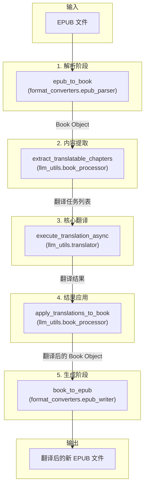

# 文档: EPUB 翻译工作流

本文档详细描述了 `MultiMediaGenAI` 项目中用于翻译 EPUB 电子书的端到端工作流。

- **执行入口**: `workflows/translate_epub.py`
- **核心目标**: 输入一个 `.epub` 文件，输出一个内容被完整翻译、同时保持原始结构和样式的新的 `.epub` 文件。

---

## 工作流架构

该工作流基于 `asyncio` 实现，以确保在处理大量翻译任务时的高性能。整个流程被精心设计为一系列可独立测试和维护的模块化步骤。

---

## 模块化步骤详解

### 1. 解析阶段 (Parsing)

- **主控脚本**: `workflows/translate_epub.py`
- **核心模块**: `format_converters.epub_parser`
- **核心函数**: `epub_to_book(epub_path)`

**任务与职责**:
1.  该函数接收 EPUB 文件的路径作为输入。
2.  在内部，它会解压 EPUB 文件，并深度解析其包文件 (`.opf`)、导航文件 (`nav.xhtml` 或 `toc.ncx`) 以及所有的内容文档 (XHTML)。
3.  它将解析出的所有信息——包括元数据、资源清单、阅读顺序(Spine)、目录结构和每一章的内容——封装到一个统一的、面向对象的数据结构 `Book` 中。
4.  这个 `Book` 对象是整个工作流中数据流转的核心载体。

**关键内部函数 (`EpubInputConverter` 类):**
- `__init__(epub_path)`: 构造函数，负责解压EPUB文件到临时目录。
- `to_book()`: 解析器的主入口方法，按顺序调用其他内部方法来构建 `Book` 对象。
- `_find_opf_path()`: 通过 `META-INF/container.xml` 文件找到核心的 `.opf` 包文件的路径。
- `_parse_opf()`: 解析 `.opf` 文件，提取书籍的元数据（标题、作者）、资源清单（manifest）和阅读顺序（spine）。
- `_parse_nav(...)`: 解析导航文件（现代的 `nav.xhtml` 或传统的 `toc.ncx`），获取章节标题和文档的语义类型（如封面、目录页）。
- `_parse_chapters()`: 遍历所有在阅读顺序（spine）中定义的章节XHTML文件，调用 `html_mapper` 将每个文件的HTML内容转换成内部的块级元素列表（`List[AnyBlock]`）。

### 2. 内容提取 (Extraction)

- **主控脚本**: `workflows/translate_epub.py`
- **核心模块**: `llm_utils.book_processor`
- **核心函数**: `extract_translatable_chapters(book, logger)`

**任务与职责**:
1.  接收第一步生成的 `Book` 对象。
2.  遍历 `Book` 对象中的所有内容项（主要是XHTML章节）。
3.  从每个章节的HTML内容中，智能地提取所有需要翻译的用户可见文本。这包括段落、标题、列表、表格内容、图注等。
4.  为了保证翻译质量，此函数会将提取的文本进行分组，形成适合LLM处理的块（chunks）。
5.  为每个待翻译的文本块生成一个唯一的ID (`llm_processing_id`)。这个ID是后续步骤中追踪和匹配翻译结果的关键。
6.  最终，函数返回一个列表，其中每个元素都是一个"翻译任务"字典，包含了唯一ID和待翻译的文本。

**关键内部函数:**
- `_prepare_chapter_content(...)`: 预处理单个章节，核心职责是为没有h1/h2等标题的"无头内容"临时注入一个标题，以提供翻译上下文。
- `_split_large_chapter(...)`: 将内容过长（超出LLM单次处理能力）的章节，拆分成多个更小的部分，每个部分都成为一个独立的翻译任务。
- `_finalize_batch(...)`: 将多个内容较短的小章节"打包"成一个批处理任务（JSON格式），以减少API调用次数，提高效率和降低成本。

### 3. 核心翻译 (Translation)

- **主控脚本**: `workflows/translate_epub.py`
- **核心模块**: `llm_utils.translator`
- **核心函数**: `execute_translation_async(...)`

**任务与职责**:
1.  这是整个工作流的性能核心和与LLM交互的中心。
2.  它接收"翻译任务"列表，以及语言、并发数、Prompts、术语表等配置。
3.  **并发管理**: 使用 `asyncio` 和 `asyncio.Semaphore` 来管理并发API请求的数量，防止因请求过快而触发API的速率限制。
4.  **Prompt 构建**: 为每个文本块动态构建符合要求的Prompt，其中可能包含翻译指令、上下文、术语表等。
5.  **API 调用**: 异步调用大语言模型（如 Gemini）的API。
6.  **错误处理与重试**: (未来优化点) 内部应包含针对单个API调用的错误处理和重试逻辑。
7.  **缓存机制**: (未来优化点) 在此层级植入缓存逻辑，可以跳过对已有翻译文本的重复请求。
8.  函数 `await` 执行完成后，返回一个翻译结果列表，每个结果都带有原始的 `llm_processing_id`。

**关键内部函数 (`Translator` 类):**
- `translate_chapters_async(...)`: 编排整个异步翻译流程，为每个翻译任务创建一个 `asyncio` 任务。
- `_call_gemini_api_async(...)`: 实际执行单次对LLM API的异步调用。它被信号量（Semaphore）包裹，以控制并发。
- `build_prompt_from_template(...)` (来自 `prompt_builder`): 一个关键的辅助函数，它根据任务类型（批处理或单块）和配置（术语表），从模板动态生成最终发送给API的完整Prompt。

### 4. 结果应用 (Application)

- **主控脚本**: `workflows/translate_epub.py`
- **核心模块**: `llm_utils.book_processor`
- **核心函数**: `apply_translations_to_book(original_book, translated_results, logger)`

**任务与职责**:
1.  接收原始的 `Book` 对象和翻译结果列表。
2.  创建一个原始 `Book` 对象的深拷贝，以确保所有修改都在一个新的 `translated_book` 对象上进行，不污染原始数据。
3.  通过 `llm_processing_id` 将每一条翻译结果精确地匹配回 `translated_book` 中对应的章节和位置。
4.  将翻译后的文本替换掉原文。同时，也会更新书的元数据，如书名和语言。
5.  返回一个内容已被完全翻译的 `translated_book` 对象。

**关键内部函数:**
- `_apply_batch_result(...)`: 解析一个"批处理"任务的翻译结果（通常是一个JSON字符串），并将其中每个子项的译文应用回对应的章节。
- `_reassemble_and_apply_split_results(...)`: 将一个被拆分的大章节的多个翻译结果，按正确的顺序重新"组装"起来，恢复成完整的章节内容。
- `_extract_title_from_injected_heading(...)`: 如果章节在提取时被注入了临时标题，此函数负责在应用结果时将翻译后的标题从正文中"剥离"出来，并存放到章节的 `title_target` 属性中。
- `_patch_toc_titles(...)`: 一个非常关键的后处理步骤。它会遍历翻译后的书籍，找到目录页（Table of Contents），并用各章节最终的译文标题来修正目录页中的链接文本，确保目录的准确性。

### 5. 生成阶段 (Writing)

- **主控脚本**: `workflows/translate_epub.py`
- **核心模块**: `format_converters.epub_writer`
- **核心函数**: `book_to_epub(book, output_path)`

**任务与职责**:
1.  接收 `translated_book` 对象和指定的输出文件路径。
2.  根据 `translated_book` 对象中的信息，在内存中或临时目录中重建EPUB所需的所有文件结构。
3.  将翻译后的章节内容写入新的XHTML文件。
4.  生成新的包文件 (`.opf`) 和导航文件 (`nav.xhtml`)，其中包含了翻译后的元数据和目录。
5.  复制所有非文本资源，如图片、CSS样式表、字体等。
6.  最后，将所有文件打包压缩，生成最终的、可供阅读的 `.epub` 文件。

**关键内部函数 (`EpubWriter` 类):**
- `write()`: 写入器的主入口，按顺序调用所有其他方法来构建EPUB。
- `_setup_directories()`: 创建EPUB所需的标准目录结构（`OEBPS`, `META-INF`）。
- `_write_resources()`: 将 `Book` 对象中存储的图片和CSS资源写入到对应的文件夹。
- `_write_chapters()`: 遍历 `Book` 中的每个 `Chapter` 对象，调用 `html_mapper` 将其内容块列表转换回XHTML文件并保存。
- `_write_opf_file()`: 生成核心的 `content.opf` 包文件，包含所有元数据、文件清单（manifest）和阅读顺序（spine）。
- `_write_nav_file()`: 根据 `Book` 对象的章节信息，生成 `nav.xhtml` 导航文件，用于在阅读器中展示目录。
- `_package_epub()`: 将临时目录中所有生成的文件和资源，按EPUB规范打包成一个 `.zip` 文件，并重命名为 `.epub`。