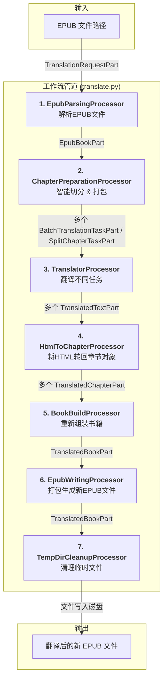

# 文档: EPUB 翻译工作流 (基于 genai-processors)

本文档详细描述了 `MultiMediaGenAI` 项目中用于翻译 EPUB 电子书的、基于 `genai-processors` 框架的端到端工作流。

- **执行入口**: `translate.py`
- **核心架构**: 基于 Google 开源的 `genai-processors` 框架，这是一个专为生成式AI设计的、异步的、流式的模块化工作流引擎。
- **核心思想**: **高内聚、低耦合、可复用**。我们将整个复杂的翻译流程，拆分成一系列獨立的、可插拔的 **处理器 (Processor)**。每个处理器只负责一项專一的任務（如解析、切分章節、翻譯、構建）。數據則被封裝在標準化的 **數據容器 (Part)** 中，在處理器之間順暢地流動。這種設計使得工作流極其清晰、易於維護和擴展。

---

## 工作流架构 (Data Flow)

---

## 处理器与数据流详解

### 1. `EpubParsingProcessor`

-   **核心职责**: 将输入的EPUB文件路径，转换为一个包含完整书籍结构的对象。
-   **输入**: `TranslationRequestPart` (包含 `text_to_translate` 字段，���值为EPUB文件路径)。
-   **输出**: `EpubBookPart` (包含一个结构化的 `Book` 对象和解压EPUB文件后产生的临时目录路径 `unzip_dir`)。
-   **涉及文件**: `processors/book/epub_parsing_processor.py`

### 2. `ChapterPreparationProcessor` (新核心)

-   **核心职责**: 智能地將一本完整的書，預處理成一系列優化過的、用於翻譯的任務。這是融合了舊工作流“智慧”的核心。
-   **输入**: `EpubBookPart`。
-   **输出**: 根據策略，產出兩種不同類型的任務 `Part`:
    -   `BatchTranslationTaskPart`: 用於將多個較短的章節打包成一個批處理任務。
    -   `SplitChapterTaskPart`: 用於將一個過長的章節，按內容塊（Block）切分成多個部分。
    -   最後，它還會將原始的 `EpubBookPart` 再次傳遞下去，供 `BookBuildProcessor` 使用。
-   **涉及文件**: `processors/book/chapter_preparation_processor.py`

### 3. `TranslatorProcessor`

-   **核心职责**: 一個多功能的“翻譯服務中心”，能夠響應不同類型的翻譯任務。
-   **输入**: `BatchTranslationTaskPart` 或 `SplitChapterTaskPart`。
-   **输出**: `TranslatedTextPart` (包含已翻譯的HTML或JSON字符串，並攜帶完整的元數據)。
-   **涉及文件**: `llm_utils/translator.py`
-   **核心逻辑**:
    -   ��查傳入 `Part` 的類型。
    -   如果是 `BatchTranslationTaskPart`，則調用為批處理JSON設計的Prompt。
    -   如果是 `SplitChapterTaskPart`，則調用為單個HTML塊設計的、經過指令強化的Prompt。
    -   將上游 `Part` 的元數據完整地複製並傳遞到產出的 `TranslatedTextPart` 中。

### 4. `HtmlToChapterProcessor`

-   **核心职责**: 将翻译好的HTML或JSON字符串，反序列化回結構化的 `Chapter` 对象。
-   **输入**: `TranslatedTextPart`。
-   **输出**: `TranslatedChapterPart` (包含一個內容已被翻譯的 `Chapter` 對象)。
-   **涉及文件**: `processors/book/html_to_chapter_processor.py`
-   **核心逻辑**:
    -   檢查傳入 `Part` 的元數據中的 `type` 字段。
    -   如果是 `'json_batch'`，則解析JSON，並為其中的每一個章節數據，生成一個 `TranslatedChapterPart`。
    -   如果是 `'text_file'`，則直接處理HTML內容，生成一個 `TranslatedChapterPart`。

### 5. `BookBuildProcessor`

-   **核心职责**: 智能的“組裝工廠”，收集所有翻譯好的獨立章節（無論是來自批處理還是切分），並將它們重新組裝成一本完整的書。
-   **输入**: 多个 `TranslatedChapterPart` 和一个 `EpubBookPart`。
-   **输出**: `TranslatedBookPart` (包含一個內容已被完全翻譯的 `Book` 對象)。
-   **涉及文件**: `processors/book/book_build_processor.py`
-   **核心逻辑**:
    -   收集所有傳入的 `TranslatedChapterPart`。
    -   對於被切分的章節，根據 `part_number` 將其內容塊重新拼接起來。
    -   使用原始的 `EpubBookPart` 作為“模具”，將所有翻譯好的章節內容精確地填充回去。

### 6. `EpubWritingProcessor` & 7. `TempDirCleanupProcessor`

-   **`EpubWritingProcessor`**:
    -   **核心职责**: 将内存中最终的 `Book` 对象，写回到磁盘上，生成一个新的 `.epub` 文件。
    -   **涉及文件**: `processors/book/epub_writing_processor.py`

-   **`TempDirCleanupProcessor`**:
    -   **核心职责**: 工作流的“清道夫”，负责清理第一步解压EPUB时创建的临时文件夹。
    -   **涉及文件**: `processors/book/temp_dir_cleanup_processor.py`
