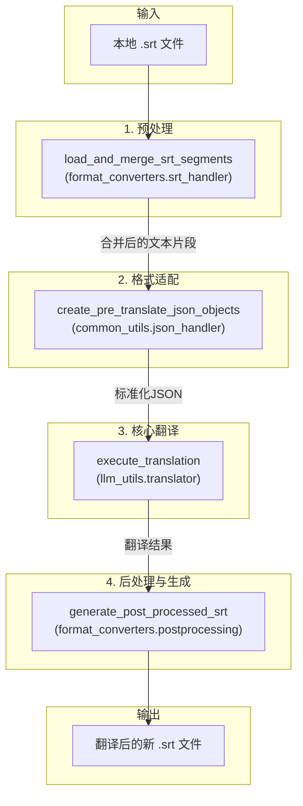

# 文档: 本地文件翻译工作流

本文档详细描述了 `MultiMediaGenAI` 项目中用于翻译本地字幕文件（目前主要为 `.srt`）的工作流。

- **执行入口**: `workflows/translate_from_file.py`
- **核心目标**: 输入一个本地 `.srt` 文件路径，输出一个翻译后的、经过优化排版的新的 `.srt` 文件。

---

## 工作流架构

与YouTube视频翻译流程类似，此工作流贯彻了统一的字幕处理逻辑，确保了不同来源的字幕都能获得一致的高质量翻译和格式化输出。

---

## 模块化步骤详解

### 1. 预处理 (Preprocessing)

- **主控脚本**: `workflows/translate_from_file.py`
- **核心模块**: `format_converters.preprocessing` (由 `srt_handler` 调用)
- **核心函数**: `load_and_merge_srt_segments(file_path, logger)`

**任务与职责**:
1.  接收本地 `.srt` 文件的路径。
2.  首先，使用 `pysrt` 库解析文件，将其转换为一个标准的片段列表。
3.  然后，调用 `format_converters.preprocessing.merge_segments_intelligently` 函数。
4.  这个关键的预处理函数会将原本零散的字幕片段（通常按时间戳分割）智能地合并成更符合自然语言习惯的、完整的句子或段落。
5.  返回一个处理过的、适合进行上下文翻译的片段列表。

**关键内部函数:**
- `srt_to_segments(...)` (来自 `srt_handler`): 使用 `pysrt` 库将原始的 SRT 文件内容解析成一个包含开始时间、结束时间和文本的字典列表。
- `merge_segments_intelligently(...)` (来自 `preprocessing`): 这是预处理的核心。它通过复杂的逻辑（包括分析标点符号）将多个短小的字幕片段合并成一个完整的句子，为翻译提供更好的上下文，从而显著提升翻译质量。

### 2. 格式适配 (Adaption)

- **主控脚本**: `workflows/translate_from_file.py`
- **核心模块**: `common_utils.json_handler`
- **核心函数**: `create_pre_translate_json_objects(...)`

**任务与职责**:
1.  接收上一步生成的片段列表。
2.  将这些片段转换为项目内部统一的"待翻译JSON对象"格式。
3.  这个JSON对象是一种富文本格式，它不仅包含待翻译的文本，还封装了元数据，如唯一的ID（这里使用文件名作为标识符）、来源类型 (`local_srt_file`)等。
4.  这种标准化的数据结构解耦了翻译模块与数据来源，使得 `translator` 模块可以处理任何来源的数据，只要它们遵循此格式。

**关键内部函数:**
- 本步骤的核心逻辑都封装在 `create_pre_translate_json_objects` 单一函数中。它遍历所有片段，为每个片段生成一个包含丰富元数据（如原始时间戳、来源等）的字典，构建出标准化的翻译任务列表。

### 3. 核心翻译 (Translation)

- **主控脚本**: `workflows/translate_from_file.py`
- **核心模块**: `llm_utils.translator`
- **核心函数**: `execute_translation(...)`

**任务与职责**:
1.  接收标准化的"待翻译JSON对象"列表。
2.  **注意**: 此处调用的是同步版本的 `execute_translation`，与EPUB工作流的 `_async` 版本不同。它通常用于处理数据量较小的任务。
3.  它负责构建Prompt、调用LLM API，并解析返回的结果。
4.  返回一个包含翻译结果的JSON对象列表。

**关键内部函数:**
- 此工作流使用的 `execute_translation` 是一个同步的包装器，其内部最终也会调用 `Translator` 类和 `build_prompt_from_template` 来完成核心的翻译任务，但它是一次性的、阻塞式的调用，不涉及 `asyncio` 并发。

### 4. 后处理与生成 (Postprocessing)

- **主控脚本**: `workflows/translate_from_file.py`
- **核心模块**: `format_converters.postprocessing`
- **核心函数**: `generate_post_processed_srt(translated_json_objects, logger)`

**任务与职责**:
1.  接收翻译后的JSON对象列表。
2.  这个函数是保证最终输出文件可读性的关键。它包含了一系列复杂的后处理逻辑，例如：
    *   根据中英文标点和词语间距，智能地调整每行字幕的长度，避免出现过长或过短的行。
    *   确保字幕的显示时间与内容长度相匹配。
    *   重新计算时间戳，生成格式规范的SRT时间码。
3.  最终，函数返回一个完整的、可以直接写入文件的SRT格式字符串。
4.  主控脚本调用 `common_utils.file_helpers.save_to_file` 将此字符串保存为最终的 `.srt` 文件。

**关键内部函数:**
- `_process_one_segment_hybrid(...)`: 后处理的核心，采用混合策略。它首先按对话符 `-` 进行分割，对分割后的部分平均分配时间；然后对每个部分再按标点符号进行更细的分割，并按比例分配时间。
- `_wrap_text(...)`: 负责将一行过长的文本，根据字符数限制和标点符号，智能地换行成多行，以符合字幕的显示标准。
- `segments_to_srt_string(...)` (来自 `srt_handler`): 在所有处理完成后，调用此函数将最终的片段列表转换成标准SRT文件格式的字符串。 