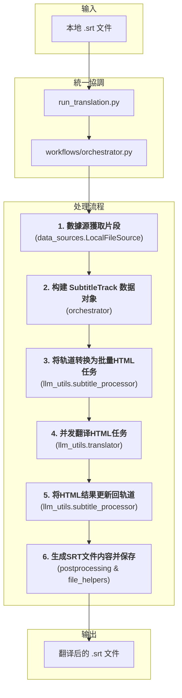

# 文档: 本地文件翻译工作流

本文档详细描述了 `MultiMediaGenAI` 项目中用于翻译本地字幕文件（目前主要为 `.srt`）的工作流。

- **执行入口**: `run_translation.py` (統一入口點)
- **核心目标**: 输入一个本地 `.srt` 文件路径，输出一个翻译后的、经过优化排版的新的 `.srt` 文件。
- **核心数据结构**: `format_converters.book_schema.SubtitleTrack`

---

## 工作流架构

此工作流是 `run_translation.py` 統一入口點的一部分，由 `workflows/orchestrator.py` 協調。它與YouTube視頻翻譯工作流共享核心邏輯，確保了不同來源的字幕都能通過統一的、健壯的流程進行處理，獲得高質量的翻譯和格式化輸出。整個流程圍繞一個中心數據結構 `SubtitleTrack` 展開，並使用 HTML 作為與大語言模型（LLM）交換數據的格式。

---

## 模块化步骤详解

### 1. 数据源獲取片段 (Data Source Segment Retrieval)

-   **主控脚本**: `workflows/orchestrator.py`
-   **核心模塊**: `data_sources.local_file_source.LocalFileSource`
-   **核心函數**: `LocalFileSource.get_segments()`
-   **任務與職責**: 這是工作流的數據輸入和準備階段。`orchestrator` 調用 `LocalFileSource` 的 `get_segments()` 方法來獲取字幕片段。`LocalFileSource` 內部負責：
    1.  **文件解析**: 調用 `format_converters.srt_handler.srt_to_segments`，使用 `pysrt` 庫將本地的 `.srt` 文件內容解析成標準的片段列表。
    2.  **智能合併**: 將解析出的片段列表傳遞給 `format_converters.preprocessing.merge_segments_intelligently` 函數。此函數通過分析標點和節奏，將零散的字幕片段合併成更完整、更適合翻譯的句子。
-   **輸出**: 一個經過合併優化的、適合翻譯的片段列表 (`list[dict]`)。

### 2. 构建 SubtitleTrack 数据对象 (Data Modeling)

-   **主控脚本**: `workflows/orchestrator.py`
-   **核心数据结构**: `format_converters.book_schema.SubtitleTrack`
-   **任务与职责**: 此步骤由 `orchestrator` 執行，將無格式的片段列表轉換為標準化的、強類型的数据对象。
    1.  **实例化 `SubtitleTrack`**: `orchestrator` 會創建一個 `SubtitleTrack` 对象。
    2.  **填充 `SubtitleSegment`**: 遍歷上一步返回的片段列表，為每個片段創建一個 `SubtitleSegment` 对象（包含ID、時間戳和原文），並將其添加到 `SubtitleTrack` 的 `segments` 列表中。
-   **核心價值**: 這一步是統一工作流的關鍵。通過將數據統一到 `SubtitleTrack` 這個"單一事實來源"中，後續所有操作都圍繞此對象進行，實現了與YouTube工作流在邏輯層面的完全統一。

### 3. 创建翻译任务 (Task Creation)

-   **主控脚本**: `workflows/orchestrator.py`
-   **核心函数**: `llm_utils.subtitle_processor.subtitle_track_to_html_tasks(...)`
-   **任务与职责**: 此步驟由 `orchestrator` 調用，直接復用了為YouTube工作流開發的核心邏輯。
    1.  **智能分批與HTML格式化**: 該函數接收 `SubtitleTrack` 對象，根據Token限制將所有片段智能地劃分為多個批次。在分批時，每個片段的原文都被序列化為一段帶有 `data-id` 等元數據屬性的HTML，確保LLM在翻譯時不會破壞這些關鍵信息。
-   **輸出**: 一個 "翻譯任務" 列表，其中每一項都包含了準備發往LLM的HTML字符串。

### 4. 核心翻译 (Core Translation)

-   **主控脚本**: `workflows/orchestrator.py`
-   **核心函数**: `llm_utils.translator.execute_translation_async(...)`
-   **任務與職責**:
    1.  **異步執行**: `orchestrator` 調用 `execute_translation_async` 函數，該函數接收上一步創建的HTML任務列表。
    2.  **並發調用**: 它使用 `asyncio` 來高效地並發執行對LLM API的調用，同時通過信號量控制並發數，兼顧速度與穩定性。
    3.  **源語言處理**: 在調用時，`source_lang_code` 參數被設置為 `"auto"`，完全依賴大語言模型的語言檢測能力來識別原文語種。
-   **輸出**: 一個包含LLM原始響應（即翻譯後的HTML字符串）的結果列表。

### 5. 应用翻译结果 (Result Application)

-   **主控脚本**: `workflows/orchestrator.py`
-   **核心函数**: `llm_utils.subtitle_processor.update_track_from_html_response(...)`
-   **任務與職責**:
    1.  **循環與解析**: `orchestrator` 遍歷翻譯結果列表。對於每個批次的已翻譯HTML，調用 `update_track_from_html_response`。
    2.  **數據就地更新**: 該函數使用 `BeautifulSoup` 解析HTML，通過 `data-id` 屬性將譯文精確地匹配回內存中的 `SubtitleTrack` 對象，並更新相應 `SubtitleSegment` 的 `translated_text` 字段。
-   **結果**: 此步驟完成後，`SubtitleTrack` 對象已成為一個包含原文和譯文的完整數據體。

### 6. 后处理与生成 (Postprocessing & Generation)

-   **主控脚本**: `workflows/orchestrator.py`
-   **核心函数**: `format_converters.postprocessing.generate_post_processed_srt(...)`
-   **任務與職責**:
    1.  **輸入變更**: `generate_post_processed_srt` 函數現在接收一個 `SubtitleTrack` 對象作為輸入，而不是之前臨時的JSON列表。
    2.  **生成SRT內容**: 它調用內部複雜的後處理邏輯（如`_process_one_segment_hybrid` 和 `_wrap_text`），對譯文進行智能拆分、計時和換行，以生成格式優美、適合播放的SRT內容。
    3.  **文件保存**: `orchestrator` 接收到最終的SRT字符串後，調用 `common_utils.file_helpers.save_to_file` 將其寫入磁盤，完成整個工作流。

**关键内部函数:**
- `_process_one_segment_hybrid(...)`: 后处理的核心，采用混合策略。它首先按对话符 `-` 进行分割，对分割后的部分平均分配时间；然后对每个部分再按标点符号进行更细的分割，并按比例分配时间。
- `_wrap_text(...)`: 负责将一行过长的文本，根据字符数限制和标点符号，智能地换行成多行，以符合字幕的显示标准。
- `segments_to_srt_string(...)` (来自 `srt_handler`): 在所有处理完成后，调用此函数将最终的片段列表转换成标准SRT文件格式的字符串。