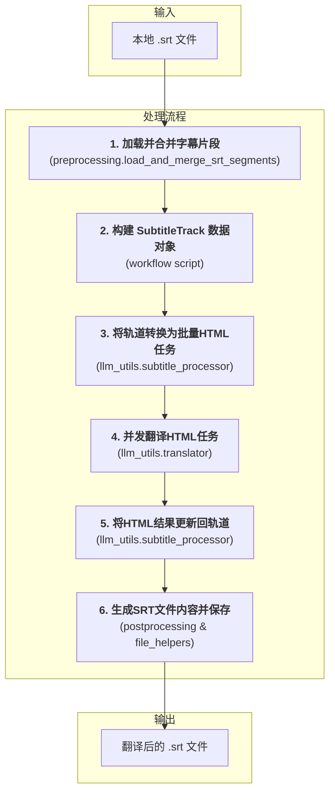

# 文档: 本地文件翻译工作流

本文档详细描述了 `MultiMediaGenAI` 项目中用于翻译本地字幕文件（目前主要为 `.srt`）的工作流。

- **执行入口**: `workflows/translate_from_file.py`
- **核心目标**: 输入一个本地 `.srt` 文件路径，输出一个翻译后的、经过优化排版的新的 `.srt` 文件。
- **核心数据结构**: `format_converters.book_schema.SubtitleTrack`

---

## 工作流架构

此工作流与YouTube视频翻译工作流采用完全一致的核心逻辑，确保了不同来源的字幕都能通过统一的、健壮的流程进行处理，获得高质量的翻译和格式化输出。它围绕一个中心数据结构 `SubtitleTrack` 展开，使用 HTML 作为与大语言模型（LLM）交换数据的格式。

---

## 模块化步骤详解

### 1. 数据加载与预处理 (Data Loading & Preprocessing)

-   **主控脚本**: `workflows/translate_from_file.py`
-   **核心函数**: `format_converters.preprocessing.load_and_merge_srt_segments(...)`
-   **任务与职责**: 这是工作流的数据输入和准备阶段。`load_and_merge_srt_segments` 函数负责：
    1.  **文件解析**: 在内部调用 `srt_handler.srt_to_segments`，使用 `pysrt` 库将本地的 `.srt` 文件内容解析成标准的片段列表。
    2.  **智能合并**: 将解析出的片段列表传递给 `merge_segments_intelligently` 函数。此函数通过分析标点和节奏，将零散的字幕片段合并成更完整的句子，为后续翻译提供高质量的上下文。
-   **输出**: 一个经过合并优化的、适合翻译的片段列表 (`list[dict]`)。

### 2. 构建数据对象 (Data Modeling)

-   **主控脚本**: `workflows/translate_from_file.py`
-   **核心数据结构**: `format_converters.book_schema.SubtitleTrack`
-   **任务与职责**: 此步骤将无格式的片段列表转换为标准化的、强类型的数据对象。
    1.  **实例化 `SubtitleTrack`**: 在主控脚本中，会创建一个 `SubtitleTrack` 对象。
    2.  **填充 `SubtitleSegment`**: 遍历上一步返回的片段列表，为每个片段创建一个 `SubtitleSegment` 对象（包含ID、时间戳和原文），并将其添加到 `SubtitleTrack` 的 `segments` 列表中。
-   **核心价值**: 这一步是统一工作流的关键。通过将数据统一到 `SubtitleTrack` 这个"单一事实来源"中，后续所有操作都围绕此对象进行，实现了与YouTube工作流在逻辑层面的完全统一。

### 3. 创建翻译任务 (Task Creation)

-   **主控脚本**: `workflows/translate_from_file.py`
-   **核心函数**: `llm_utils.subtitle_processor.subtitle_track_to_html_tasks(...)`
-   **任务与职责**: 此步骤直接复用了为YouTube工作流开发的核心逻辑。
    1.  **智能分批与HTML格式化**: 该函数接收 `SubtitleTrack` 对象，根据Token限制将所有片段智能地划分为多个批次。在分批时，每个片段的原文都被序列化为一段带有 `data-id` 等元数据属性的HTML，确保LLM在翻译时不会破坏这些关键信息。
-   **输出**: 一个 "翻译任务" 列表，其中每一项都包含了准备发往LLM的HTML字符串。

### 4. 核心翻译 (Core Translation)

-   **主控脚本**: `workflows/translate_from_file.py`
-   **核心函数**: `llm_utils.translator.execute_translation_async(...)`
-   **任务与职责**:
    1.  **异步执行**: 工作流现在是异步的。`execute_translation_async` 函数接收上一步创建的HTML任务列表。
    2.  **并发调用**: 它使用 `asyncio` 来高效地并发执行对LLM API的调用，同时通过信号量控制并发数，兼顾速度与稳定性。
    3.  **源语言处理**: 在调用时，`source_lang_code` 参数被设置为 `"auto"`，完全依赖大语言模型的语言检测能力来识别原文语种。
-   **输出**: 一个包含LLM原始响应（即翻译后的HTML字符串）的结果列表。

### 5. 应用翻译结果 (Result Application)

-   **主控脚本**: `workflows/translate_from_file.py`
-   **核心函数**: `llm_utils.subtitle_processor.update_track_from_html_response(...)`
-   **任务与职责**:
    1.  **循环与解析**: 主控脚本遍历翻译结果列表。对于每个批次的已翻译HTML，调用 `update_track_from_html_response`。
    2.  **数据就地更新**: 该函数使用 `BeautifulSoup` 解析HTML，通过 `data-id` 属性将译文精确地匹配回内存中的 `SubtitleTrack` 对象，并更新相应 `SubtitleSegment` 的 `translated_text` 字段。
-   **结果**: 此步骤完成后，`SubtitleTrack` 对象已成为一个包含原文和译文的完整数据体。

### 6. 后处理与生成 (Postprocessing & Generation)

-   **主控脚本**: `workflows/translate_from_file.py`
-   **核心函数**: `format_converters.postprocessing.generate_post_processed_srt(...)`
-   **任务与职责**:
    1.  **输入变更**: `generate_post_processed_srt` 函数现在接收一个 `SubtitleTrack` 对象作为输入，而不是之前临时的JSON列表。
    2.  **生成SRT内容**: 它调用内部复杂的后处理逻辑（如`_process_one_segment_hybrid` 和 `_wrap_text`），对译文进行智能拆分、计时和换行，以生成格式优美、适合播放的SRT内容。
    3.  **文件保存**: 主控脚本接收到最终的SRT字符串后，调用 `common_utils.file_helpers.save_to_file` 将其写入磁盘，完成整个工作流。

**关键内部函数:**
- `_process_one_segment_hybrid(...)`: 后处理的核心，采用混合策略。它首先按对话符 `-` 进行分割，对分割后的部分平均分配时间；然后对每个部分再按标点符号进行更细的分割，并按比例分配时间。
- `_wrap_text(...)`: 负责将一行过长的文本，根据字符数限制和标点符号，智能地换行成多行，以符合字幕的显示标准。
- `segments_to_srt_string(...)` (来自 `srt_handler`): 在所有处理完成后，调用此函数将最终的片段列表转换成标准SRT文件格式的字符串。 