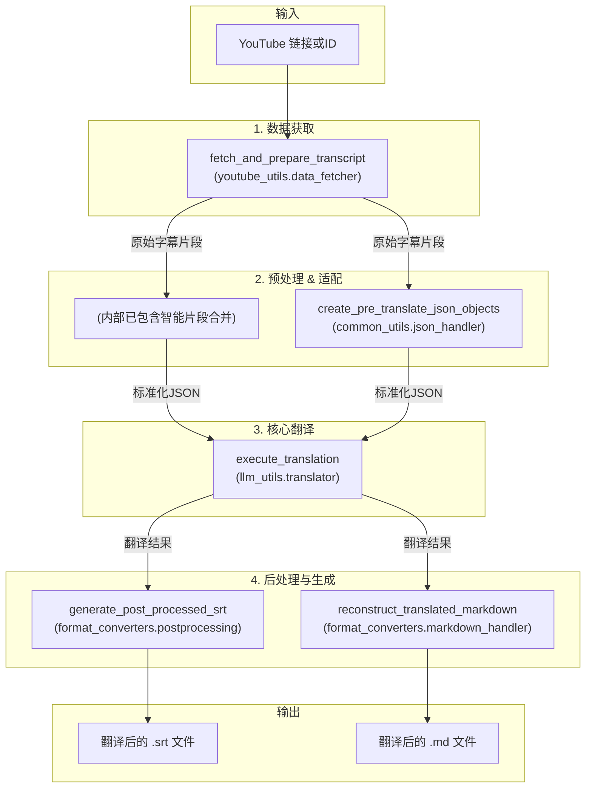

# 文档: YouTube 视频翻译工作流

本文档详细描述了 `MultiMediaGenAI` 项目中用于获取、翻译并生成 YouTube 视频字幕的端到端工作流。

- **执行入口**: `workflows/translate_youtube_video.py`
- **核心目标**: 输入一个 YouTube 视频链接或ID，输出该视频的翻译字幕文件（`.srt` 和 `.md` 格式）。

---

## 工作流架构

此工作流是项目内功能最全面的流程，它在统一的字幕处理核心之上，增加了一个专门的数据获取层。

---

## 模块化步骤详解

### 1. 数据获取 (Fetching)

- **主控脚本**: `workflows/translate_youtube_video.py`
- **核心模块**: `youtube_utils.data_fetcher`
- **核心函数**: `fetch_and_prepare_transcript(video_id, logger)`

**任务与职责**:
1.  这是此工作流与其它流程最显著的区别。
2.  接收一个 YouTube 视频 ID 作为输入。
3.  使用 `youtube_transcript_api` 库从 YouTube 获取可用的字幕。它会按优先级尝试获取用户手动上传的字幕，然后是自动生成的字幕。
4.  **内置预处理**: 获取到原始字幕数据后，此函数 **立即** 调用 `preprocessing.merge_segments_intelligently`，将零散的字幕片段合并为完整的句子。
5.  因此，该函数输出的已经是经过第一轮智能预处理的、适合翻译的文本片段列表，同时还会返回获取到的字幕语言代码和来源类型。

**关键内部函数:**
- `get_video_id(...)`: 从完整的YouTube URL中提取出唯一的视频ID。
- `get_youtube_video_title(...)`: 使用 `pytubefix` 库获取视频的标题，用于生成易于识别的文件名。
- `get_youtube_transcript(...)`: 这是与 `youtube_transcript_api` 交互的核心。它包含复杂的逻辑，按顺序（手动/自动，按语言偏好）查找最合适的字幕，并包含重试机制以应对网络问题。
- `merge_segments_intelligently(...)` (来自 `preprocessing`): 在获取到原始字幕后，立即调用此函数进行智能合并，为后续翻译提供高质量的输入。

### 2. 格式适配 (Adaption)

- **主控脚本**: `workflows/translate_youtube_video.py`
- **核心模块**: `common_utils.json_handler`
- **核心函数**: `create_pre_translate_json_objects(...)`

**任务与职责**:
1.  此步骤与"本地文件翻译工作流"完全相同。
2.  它接收经过预处理的片段列表，并将其转换为项目内部统一的"待翻译JSON对象"格式，为送入翻译器做准备。

**关键内部函数:**
- `create_pre_translate_json_objects(...)`: 遍历所有片段，为每个片段生成一个包含丰富元数据（如原始时间戳、来源等）的字典，构建出标准化的翻译任务列表。

### 3. 核心翻译 (Translation)

- **主控脚本**: `workflows/translate_youtube_video.py`
- **核心模块**: `llm_utils.translator`
- **核心函数**: `execute_translation(...)`

**任务与职责**:
1.  此步骤与"本地文件翻译工作流"完全相同。
2.  接收标准化的JSON对象列表，调用LLM API，然后返回包含翻译结果的列表。

**关键内部函数:**
- `execute_translation(...)`: 一个同步的包装器，其内部最终也会调用 `Translator` 类和 `build_prompt_from_template` 来完成核心的翻译任务。

### 4. 后处理与生成 (Postprocessing & Generation)

- **主控脚本**: `workflows/translate_youtube_video.py`
- **核心模块**: `format_converters.postprocessing` 和 `format_converters.markdown_handler`
- **核心函数**: 
    - `generate_post_processed_srt(...)`
    - `reconstruct_translated_markdown(...)`

**任务与职责**:
1.  接收翻译后的JSON对象列表。
2.  此工作流会生成两种格式的输出文件：
    *   **SRT 文件**: 调用与其它工作流完全相同的 `generate_post_processed_srt` 函数，生成经过精美排版的 `.srt` 字幕文件。
    *   **Markdown 文件**: 调用 `reconstruct_translated_markdown` 函数，生成一个将原文和译文并排展示的 `.md` 文件，便于校对和阅读。
3.  主控脚本负责将这两个函数返回的字符串内容保存到对应的文件中。此外，为了便于调试，工作流还会保存翻译前后的 `jsonl` 文件。

**关键内部函数:**
- `generate_post_processed_srt(...)` (来自 `postprocessing`): 调用后处理模块的核心功能，生成高质量的SRT文件内容。
- `reconstruct_translated_markdown(...)` (来自 `markdown_handler`): 遍历翻译结果，生成一个结构化的、便于对比阅读的Markdown格式字符串。 