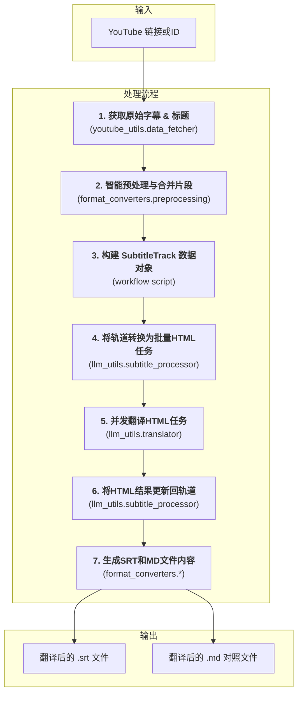

# 文档: YouTube 视频翻译工作流

本文档详细描述了 `MultiMediaGenAI` 项目中用于获取、翻译并生成 YouTube 视频字幕的端到端工作流。

- **执行入口**: `workflows/translate_youtube_video.py`
- **核心目标**: 输入一个 YouTube 视频链接或ID，输出该视频的翻译字幕文件（`.srt` 和 `.md` 格式）。
- **核心数据结构**: `format_converters.book_schema.SubtitleTrack`

---

## 工作流架构

此工作流经过重构，采用了更健壮和模块化的设计。它围绕一个中心数据结构 `SubtitleTrack` 展开，使用 HTML 作为与大语言模型（LLM）交换数据的格式，以确保元数据（如时间戳）的无损传递。

---

## 模块化步骤详解

### 1. 数据获取与预处理 (Fetching & Preprocessing)

-   **主控脚本**: `workflows/translate_youtube_video.py`
    -   在 `main_async` 函数中，工作流通过调用 `fetch_and_prepare_transcript` 来启动数据处理流程。
-   **核心模块 1**: `youtube_utils/data_fetcher.py`
    -   **核心函数**: `fetch_and_prepare_transcript(video_id, logger)`
    -   **任务与职责**: 此函数是数据准备的"总指挥"，它协同调用其他底层函数完成一个两阶段任务：
        1.  **获取原始字幕**: 在内部，它调用 `get_youtube_transcript` 函数。该函数使用 `youtube_transcript_api` 库与 YouTube 进行交互，根据 `config.py` 中定义的语言偏好 (`PREFERRED_TRANSCRIPT_LANGUAGES`)，优先尝试获取手动上传的、质量更高的字幕，如果找不到，再降级获取自动生成的字幕。
        2.  **智能合并片段**: 获取到原始的、通常比较零碎的字幕片段后，此函数会立即将其传递给 `merge_segments_intelligently` 进行预处理。
-   **核心模块 2**: `format_converters/preprocessing.py`
    -   **核心函数**: `merge_segments_intelligently(transcript_segments, logger)`
    -   **任务与职责**: 此函数的目的是解决自动语音识别（ASR）字幕常见的不自然断句问题。它并非简单地拼接，而是通过分析标点符号（如句号、问号）和文本节奏，将原本短小的片段合并成更完整、更符合自然语言习惯的句子或段落。这样做能为后续的大语言模型（LLM）提供更丰富的上下文，从而显著提升翻译的连贯性和准确性。
-   **输出**: 整个步骤的最终产出是一个经过清理和优化的字幕片段列表（`merged_transcript_data`），为下一步的结构化建模做好了准备。

### 2. 构建数据对象 (Data Modeling)

-   **主控脚本**: `workflows/translate_youtube_video.py`
    -   在 `main_async` 函数内部，紧接着上一步。
-   **任务与职责**:
    1.  **实例化 `SubtitleTrack`**: 工作流将上一步返回的 `merged_transcript_data`（一个字典列表）转换为一个中心化的、强类型的 Pydantic 数据模型——`SubtitleTrack` 对象。此对象不仅包含了视频ID和语言代码，还将成为整个流程中所有数据的载体。
    2.  **填充 `SubtitleSegment`**: 遍历 `merged_transcript_data` 列表中的每一个片段，为每个片段创建一个 `SubtitleSegment` 对象，并将其添加到 `SubtitleTrack.segments` 列表中。每个 `SubtitleSegment` 都包含唯一的ID（`seg_...`）、精确的开始/结束时间戳和原文（`source_text`）。
-   **核心价值**: 这一步是新架构的基石。通过将零散数据统一到 `SubtitleTrack` 这个"单一事实来源"中，后续所有的操作（分批、翻译、更新、生成）都围绕这个对象进行，极大地提高了代码的可维护性和数据的完整性。

### 3. 创建翻译任务 (Task Creation)

-   **主控脚本**: `workflows/translate_youtube_video.py`
-   **核心模块**: `llm_utils/subtitle_processor.py`
    -   **核心函数**: `subtitle_track_to_html_tasks(track, logger)`
    -   **任务与职责**:
        1.  **智能分批 (Batching)**: 此函数的核心职责是将 `SubtitleTrack` 中的所有 `SubtitleSegment` 划分为适合LLM处理的多个批次。它通过一个通用的 `create_batched_tasks` 函数实现，根据 `config.py` 中配置的Token限制（考虑到语言扩展因子和安全边际），确保每个批次的内容都不会因为太长而被LLM截断。
        2.  **HTML 格式化**: 在分批过程中，每个 `SubtitleSegment` 的原文都会被序列化为一段HTML。具体来说，`_serialize_subtitle_segment` 函数会将文本包裹在 `
` 标签中，并将片段的唯一ID (`segment.id`) 和时间戳编码到父级 `
` 的 `data-*` 属性里。这种设计巧妙地将元数据"隐藏"起来，让LLM专注于翻译文本内容，同时保证了这些关键信息在翻译过程中不会丢失或被篡改。
-   **输出**: 返回一个 "翻译任务" 列表 (`tasks_to_translate`)。列表中的每一项都是一个字典，包含了批次ID和准备发往LLM的、包含多个片段的HTML字符串。

### 4. 核心翻译 (Translation)

-   **主控脚本**: `workflows/translate_youtube_video.py`
-   **核心模块**: `llm_utils/translator.py`
    -   **入口函数**: `execute_translation_async(...)`
    -   **核心执行函数**: `Translator.translate_chapters_async(...)` (此函数与EPUB工作流共用)
-   **任务与职责**:
    1.  **并发控制**: `execute_translation_async` 首先实例化一个 `Translator` 对象。核心的 `translate_chapters_async` 方法使用 `asyncio.Semaphore` 来创建一个并发任务池，从而能以受控的并发数（例如同时5个）向LLM API发出请求，兼顾了速度与稳定性。
    2.  **Prompt 构建**: 对于每一个任务（HTML批次），它会从 `prompts.json` 加载为字幕翻译定制的Prompt模板（`html_subtitle_system_prompt` 和 `html_subtitle_user_prompt`），并将HTML内容填入，构建最终的API请求。
    3.  **异步API调用**: `_call_gemini_api_async` 函数负责实际与Google Gemini API的通信。它使用 `await self.model.generate_content_async(...)` 发起异步调用，并设置了超时以防卡死。
    4.  **日志记录**: 每次成功的API调用后，LLM返回的原始、未经处理的HTML响应会被记录到一个 `.jsonl` 日志文件中，便于调试和问题追溯。
-   **输出**: 返回一个包含LLM原始响应（即翻译后的HTML字符串）的结果列表。

### 5. 应用翻译结果 (Result Application)

-   **主控脚本**: `workflows/translate_youtube_video.py`
-   **核心模块**: `llm_utils/subtitle_processor.py`
    -   **核心函数**: `update_track_from_html_response(track, translated_html, logger)`
-   **任务与职责**:
    1.  **循环处理**: 工作流在 `main_async` 中遍历上一步返回的翻译结果列表。对于每一个批次的翻译结果（一个HTML字符串），它都会调用 `update_track_from_html_response`。
    2.  **HTML 精确解析**: 函数内部使用 `BeautifulSoup` 库来解析LLM返回的HTML。它会查找所有 `
` 标签。
    3.  **数据就地更新**: 对于每个解析出的 `div`，它会提取出 `data-id` 属性，并根据这个ID在原始的 `SubtitleTrack` 对象的 `segments` 列表中找到对应的 `SubtitleSegment`。然后，它提取 `
` 标签内的译文，并将其赋值给该 `SubtitleSegment` 对象的 `translated_text` 字段。这个过程是"就地更新"，直接修改了内存中的 `SubtitleTrack` 对象。
-   **结果**: 在这个步骤完成后，中心的 `SubtitleTrack` 对象现在已经是一个完整的数据体，同时包含了所有片段的原文和精准匹配的译文。

### 6. 后处理与生成 (Postprocessing & Generation)

-   **主控脚本**: `workflows/translate_youtube_video.py`
    -   在 `_generate_output_files` 函数中执行。
-   **核心模块 1**: `format_converters/postprocessing.py`
    -   **核心函数**: `generate_post_processed_srt(subtitle_track, logger)`
    -   **任务与职责**: 此函数的目标是生成一个高质量、符合播放器标准的SRT文件。它接收完整的 `SubtitleTrack` 对象，然后调用 `post_process_translated_segments`。这个后处理器会进行精细的二次处理：根据译文的标点（如句号、逗号、破折号）和长度，对原有的字幕片段进行再次拆分或合并，并重新计算时间码，以确保字幕的显示节奏和断行都尽可能自然、易读。最后，它调用 `srt_handler.segments_to_srt_string` 生成最终的SRT文件内容。
-   **核心模块 2**: `format_converters/markdown_handler.py`
    -   **核心函数**: `reconstruct_translated_markdown(subtitle_track, target_lang, logger)`
    -   **任务与职责**: 此函数也接收同一个 `SubtitleTrack` 对象。它的任务是生成一个双语对照的Markdown文件，用于人工校对。它会遍历所有片段，将每个片段的时间戳、原文和译文格式化成清晰的、一一对应的形式。
-   **文件写入**: `workflows/translate_youtube_video.py` 中的 `save_to_file` 工具函数负责将这两个核心函数返回的字符串内容分别写入对应的 `.srt` 和 `.md` 文件中，完成整个工作流。

**关键内部函数:**
- `generate_post_processed_srt(...)` (来自 `postprocessing`): 调用后处理模块的核心功能，生成高质量的SRT文件内容。
- `reconstruct_translated_markdown(...)` (来自 `markdown_handler`): 遍历翻译结果，生成一个结构化的、便于对比阅读的Markdown格式字符串。 