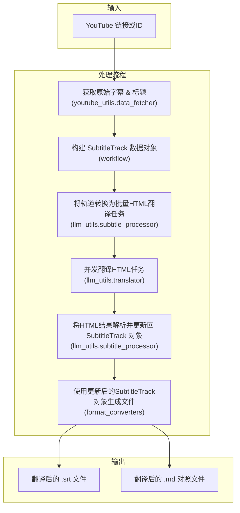

# 文档: YouTube 视频翻译工作流

本文档详细描述了 `MultiMediaGenAI` 项目中用于获取、翻译并生成 YouTube 视频字幕的端到端工作流。

- **执行入口**: `workflows/translate_youtube_video.py`
- **核心目标**: 输入一个 YouTube 视频链接或ID，输出该视频的翻译字幕文件（`.srt` 和 `.md` 格式）。
- **核心数据结构**: `format_converters.book_schema.SubtitleTrack`

---

## 工作流架构

此工作流经过重构，采用了更健壮和模块化的设计。它围绕一个中心数据结构 `SubtitleTrack` 展开，使用 HTML 作为与大语言模型（LLM）交换数据的格式，以确保元数据（如时间戳）的无损传递。

---

## 模块化步骤详解

### 1. 数据获取 (Fetching)

- **主控脚本**: `workflows/translate_youtube_video.py`
- **核心模块**: `youtube_utils.data_fetcher`
- **核心函数**: `fetch_transcript(video_id, logger)`

**任务与职责**:
1.  接收一个 YouTube 视频 ID 作为输入。
2.  使用 `youtube_transcript_api` 库从 YouTube 获取可用的原始字幕片段。它会按优先级尝试获取用户手动上传的字幕，其次是自动生成的字幕。
3.  同时，使用 `pytubefix` 获取视频的标题，用于后续生成易于识别的文件名。
4.  **与旧版区别**: 此函数现在的职责非常单一，只负责获取最原始的数据（字幕片段列表和标题），不再进行任何预处理（如合并片段）。
5.  返回包含原始字幕片段、语言代码和视频标题的元组。

### 2. 构建数据对象 (Data Modeling)

- **主控脚本**: `workflows/translate_youtube_video.py`

**任务与职责**:
1.  这是新架构的核心步骤之一。
2.  工作流脚本接收到 `fetch_transcript` 返回的原始字幕片段后，会立即将这些零散的数据转换为一个结构化的 `SubtitleTrack` Pydantic 模型实例。
3.  `SubtitleTrack` 对象将作为整个后续流程中数据传递和操作的载体，它包含了视频标题、语言和所有字幕片段 `SubtitleSegment`（包含文本、开始/结束时间）。

### 3. 创建翻译任务 (Task Creation)

- **主控脚本**: `workflows/translate_youtube_video.py`
- **核心模块**: `llm_utils.subtitle_processor`
- **核心函数**: `subtitle_track_to_html_tasks(track, prompt_template, ...)`

**任务与职责**:
1.  **智能分批**: 此函数复用了 EPUB 工作流中的智能分批逻辑。它会根据 LLM 的 Token 限制，将 `SubtitleTrack` 中的所有片段智能地划分为一个或多个批次。这解决了长视频翻译内容被截断的问题。
2.  **HTML 格式化**: 对于每个批次，函数会将需要翻译的字幕文本包裹在 `
` 标签中，并将每个片段的唯一ID (`segment.id`) 和时间戳编码到 `data-*` 属性里。这种 HTML 格式确保了 LLM 在翻译时不会破坏元数据。
3.  **Prompt 构建**: 将格式化后的 HTML 内容填入用户提供的 Prompt 模板中，为每个批次生成一个最终可以直接发送给 LLM 的翻译任务。
4.  返回一个 "翻译任务" 列表。

### 4. 核心翻译 (Translation)

- **主控脚本**: `workflows/translate_youtube_video.py`
- **核心模块**: `llm_utils.translator`
- **核心函数**: `Translator.translate_async(...)`

**任务与职责**:
1.  此步骤与 EPUB 工作流共享同一个通用的翻译器。
2.  它接收 `subtitle_processor` 生成的翻译任务列表。
3.  使用 `asyncio` 高效地并发执行对 LLM API 的调用。
4.  返回一个包含 LLM 响应（即翻译后的 HTML）的原始结果列表。

### 5. 应用翻译结果 (Result Application)

- **主控脚本**: `workflows/translate_youtube_video.py`
- **核心模块**: `llm_utils.subtitle_processor`
- **核心函数**: `update_track_from_html_response(html_responses, original_track, ...)`

**任务与职责**:
1.  接收原始的 `SubtitleTrack` 对象和 LLM 返回的翻译结果（HTML字符串列表）。
2.  **HTML 解析**: 使用 `BeautifulSoup` 解析每一个 HTML 响应。
3.  **数据更新**: 通过 `data-segment-id` 属性，将每个 `
` 标签内的译文精确地匹配回 `SubtitleTrack` 对象中对应的 `SubtitleSegment`，并更新其 `translated_text` 字段。
4.  函数执行后，`SubtitleTrack` 对象现在同时包含了原文和译文。

### 6. 后处理与生成 (Postprocessing & Generation)

- **主控脚本**: `workflows/translate_youtube_video.py`
- **核心模块**: `format_converters.postprocessing` 和 `format_converters.markdown_handler`
- **核心函数**: 
    - `generate_post_processed_srt(track, ...)`
    - `reconstruct_translated_markdown(track)`

**任务与职责**:
1.  **输入变更**: 这两个后处理函数现在接收 `SubtitleTrack` 对象作为输入，而不是旧版的 JSON 列表。
2.  **SRT 生成**: `generate_post_processed_srt` 遍历 `SubtitleTrack` 中的片段，利用其时间戳和 `translated_text` 生成符合 SRT 格式标准、且经过优化排版的字幕文件内容。
3.  **Markdown 生成**: `reconstruct_translated_markdown` 则生成一个包含原文和译文的双语对照 Markdown 文件，格式清晰，便于校对。
4.  工作流脚本负责将这两个函数返回的字符串写入对应的 `.srt` 和 `.md` 文件中。

**关键内部函数:**
- `generate_post_processed_srt(...)` (来自 `postprocessing`): 调用后处理模块的核心功能，生成高质量的SRT文件内容。
- `reconstruct_translated_markdown(...)` (来自 `markdown_handler`): 遍历翻译结果，生成一个结构化的、便于对比阅读的Markdown格式字符串。 