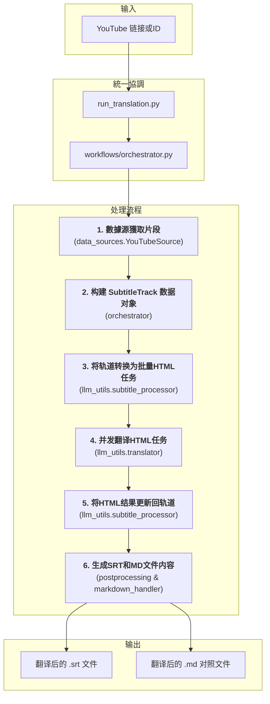

# 文档: YouTube 视频翻译工作流

本文档详细描述了 `MultiMediaGenAI` 项目中用于获取、翻译并生成 YouTube 视频字幕的端到端工作流。

- **执行入口**: `run_translation.py` (統一入口點)
- **核心目标**: 输入一个 YouTube 视频链接或ID，输出该视频的翻译字幕文件（`.srt` 和 `.md` 格式）。
- **核心数据结构**: `format_converters.book_schema.SubtitleTrack`

---

## 工作流架构

此工作流是 `run_translation.py` 統一入口點的一部分，由 `workflows/orchestrator.py` 協調。它經過重構，採用了更健壯和模塊化的設計。整個流程圍繞一個中心數據結構 `SubtitleTrack` 展開，並使用 HTML 作為與大語言模型（LLM）交換數據的格式，以確保元數據（如時間戳）的無損傳遞。

---

## 模块化步骤详解

### 1. 数据源獲取片段 (Data Source Segment Retrieval)

-   **主控脚本**: `workflows/orchestrator.py`
-   **核心模塊**: `data_sources.youtube_source.YouTubeSource`
-   **核心函數**: `YouTubeSource.get_segments()`
-   **任務與職責**: 這是工作流的數據輸入和準備階段。`orchestrator` 調用 `YouTubeSource` 的 `get_segments()` 方法來獲取字幕片段。`YouTubeSource` 內部負責：
    1.  **獲取原始字幕**: 調用 `youtube_utils.data_fetcher.fetch_and_prepare_transcript`。該函數使用 `youtube_transcript_api` 庫與 YouTube 進行交互，根據 `config.py` 中定義的語言偏好 (`PREFERRED_TRANSCRIPT_LANGUAGES`)，優先嘗試獲取手動上傳的、質量更高的字幕，如果找不到，再降級獲取自動生成的字幕。
    2.  **智能合併片段**: 獲取到原始的、通常比較零碎的字幕片段後，此函數會立即將其傳遞給 `format_converters.preprocessing.merge_segments_intelligently` 進行預處理。
-   **輸出**: 一個經過清理和優化的字幕片段列表（`merged_transcript_data`），為下一步的結構化建模做好了準備。

### 2. 构建 SubtitleTrack 数据对象 (Data Modeling)

-   **主控脚本**: `workflows/orchestrator.py`
-   **核心数据结构**: `format_converters.book_schema.SubtitleTrack`
-   **任務與職責**: 此步驟由 `orchestrator` 執行，將無格式的片段列表轉換為標準化的、強類型的数据对象。
    1.  **实例化 `SubtitleTrack`**: `orchestrator` 會創建一個 `SubtitleTrack` 对象。
    2.  **填充 `SubtitleSegment`**: 遍歷上一步返回的片段列表，為每個片段創建一個 `SubtitleSegment` 对象（包含ID、時間戳和原文），並將其添加到 `SubtitleTrack` 的 `segments` 列表中。每個 `SubtitleSegment` 都包含唯一的ID（`seg_...`）、精確的開始/結束時間戳和原文（`source_text`）。
-   **核心價值**: 這一步是新架構的基石。通過將零散數據統一到 `SubtitleTrack` 這個"單一事實來源"中，後續所有的操作（分批、翻譯、更新、生成）都圍繞這個對象進行，極大地提高了代碼的可維護性和數據的完整性。

### 3. 创建翻译任务 (Task Creation)

-   **主控脚本**: `workflows/orchestrator.py`
-   **核心模块**: `llm_utils/subtitle_processor.py`
    -   **核心函数**: `subtitle_track_to_html_tasks(track, logger)`
-   **任務與職責**:
    1.  **智能分批 (Batching)**: 此函數的核心職責是將 `SubtitleTrack` 中的所有 `SubtitleSegment` 劃分為適合LLM處理的多個批次。它通過一個通用的 `create_batched_tasks` 函數實現，根據 `config.py` 中配置的Token限制（考慮到語言擴展因子和安全邊際），確保每個批次的内容都不會因為太長而被LLM截斷。
    2.  **HTML 格式化**: 在分批過程中，每個 `SubtitleSegment` 的原文都會被序列化為一段HTML。具體來說，`_serialize_subtitle_segment` 函數會將文本包裹在 `
` 標籤中，並將片段的唯一ID (`segment.id`) 和時間戳編碼到父級 `
` 的 `data-*` 屬性裡。這種設計巧妙地將元數據"隱藏"起來，讓LLM專注於翻譯文本內容，同時保證了這些關鍵信息在翻譯過程中不會丟失或被篡改。
-   **輸出**: 返回一個 "翻譯任務" 列表 (`tasks_to_translate`)。列表中的每一項都是一個字典，包含了批次ID和準備發往LLM的、包含多個片段的HTML字符串。

### 4. 核心翻译 (Translation)

-   **主控脚本**: `workflows/orchestrator.py`
-   **核心模块**: `llm_utils/translator.py`
    -   **入口函数**: `execute_translation_async(...)`
    -   **核心执行函数**: `Translator.translate_chapters_async(...)`
-   **任務與職責**:
    1.  **並發控制**: `orchestrator` 調用 `execute_translation_async`，該函數首先實例化一個 `Translator` 對象。核心的 `translate_chapters_async` 方法使用 `asyncio.Semaphore` 來創建一個並發任務池，從而能以受控的並發數（例如同時5個）向LLM API發出請求，兼顧了速度與穩定性。
    2.  **Prompt 构建**: 對於每一個任務（HTML批次），它會從 `prompts.json` 加載為字幕翻譯定制的Prompt模板（`html_subtitle_system_prompt` 和 `html_subtitle_user_prompt`），並將HTML內容填入，構建最終的API請求。
    3.  **異步API調用**: `_call_gemini_api_async` 函數負責實際與Google Gemini API的通信。它使用 `await self.model.generate_content_async(...)` 發起異步調用，並設置了超時以防卡死。
    4.  **日誌記錄**: 每次成功的API調用後，LLM返回的原始、未經處理的HTML響應會被記錄到一個 `.jsonl` 日誌文件中，便於調試和問題追溯。
-   **輸出**: 返回一個包含LLM原始響應（即翻譯後的HTML字符串）的結果列表。

### 5. 应用翻译结果 (Result Application)

-   **主控脚本**: `workflows/orchestrator.py`
-   **核心模块**: `llm_utils/subtitle_processor.py`
    -   **核心函数**: `update_track_from_html_response(track, translated_html, logger)`
-   **任務與職責**:
    1.  **循環處理**: `orchestrator` 遍歷上一步返回的翻譯結果列表。對於每一個批次的翻譯結果（一個HTML字符串），它都會調用 `update_track_from_html_response`。
    2.  **HTML 精確解析**: 函數內部使用 `BeautifulSoup` 庫來解析LLM返回的HTML。它會查找所有 `
` 標籤。
    3.  **數據就地更新**: 對於每個解析出的 `div`，它會提取出 `data-id` 屬性，並根據這個ID在原始的 `SubtitleTrack` 對象的 `segments` 列表中找到對應的 `SubtitleSegment`。然後，它提取 `
` 標籤內的譯文，並將其賦值給該 `SubtitleSegment` 對象的 `translated_text` 字段。這個過程是"就地更新"，直接修改了內存中的 `SubtitleTrack` 對象。
-   **結果**: 在這個步驟完成後，中心的 `SubtitleTrack` 對象現在已經是一個完整的数据體，同時包含了所有片段的原文和精準匹配的譯文。

### 6. 后处理与生成 (Postprocessing & Generation)

-   **主控脚本**: `workflows/orchestrator.py`
    -   在 `orchestrator` 的 `run` 函數中執行。
-   **核心模块 1**: `format_converters/postprocessing.py`
    -   **核心函数**: `generate_post_processed_srt(subtitle_track, logger)`
    -   **任務與職責**: 此函數的目標是生成一個高質量、符合播放器標準的SRT文件。它接收完整的 `SubtitleTrack` 對象，然後調用 `post_process_translated_segments`。這個後處理器會進行精細的二次處理：根據譯文的標點（如句號、逗號、破折號）和長度，對原有的字幕片段進行再次拆分或合併，並重新計算時間碼，以確保字幕的顯示節奏和斷行都盡可能自然、易讀。最後，它調用 `srt_handler.segments_to_srt_string` 生成最終的SRT文件內容。
-   **核心模块 2**: `format_converters/markdown_handler.py`
    -   **核心函数**: `reconstruct_translated_markdown(subtitle_track, target_lang, logger)`
    -   **任務與職責**: 此函數也接收同一個 `SubtitleTrack` 對象。它的任務是生成一個雙語對照的Markdown文件，用於人工校對。它會遍歷所有片段，將每個片段的時間戳、原文和譯文格式化成清晰的、一一對應的形式。
-   **文件写入**: `orchestrator` 中的 `save_to_file` 工具函數負責將這兩個核心函數返回的字符串內容分別寫入對應的 `.srt` 和 `.md` 文件中，完成整個工作流。 