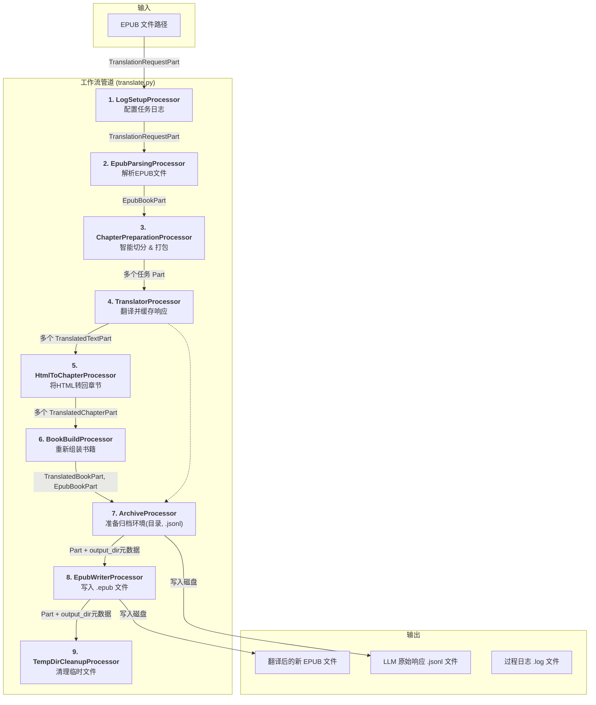

# 文档: EPUB 翻译工作流 (基于 genai-processors)

本文档详细描述了 `MultiMediaGenAI` 项目中用于翻译 EPUB 电子书的、基于 `genai-processors` 框架的端到端工作流。

- **执行入口**: `translate.py`
- **核心架构**: 基于 Google 开源的 `genai-processors` 框架，这是一个专为生成式AI设计的、异步的、流式的模块化工作流引擎。
- **核心思想**: **高内聚、低耦合、可复用**。我们将整个复杂的翻译流程，拆分成一系列獨立的、可插拔的 **处理器 (Processor)**。每个处理器只负责一项專一的任務。數據則被封裝在標準化的 **數據容器 (Part)** 中，在處理器之間順暢地流動。

---

## 工作流架构 (Data Flow)


*<p align="center">虚线表示 `OutputGenerationProcessor` 依赖 `TranslatorProcessor` 的实例来获取缓存数据。</p>*

---

## 处理器与数据流详解

### 1. `LogSetupProcessor`

-   **核心职责**: 工作流的“前哨”，在流程开始时，动态地为本次任务配置好专属的日志文件。
-   **输入**: `TranslationRequestPart`。
-   **核心逻辑**:
    -   只对流中的第一个 `Part` 操作一次。
    -   从 `Part` 的元数据中读取原始文件名和输出目录。
    -   在 `GlobalWorkflowOutputs/原始文件名/` 目录下创建 `processing.log`。
    -   获取全局日志记录器 (`RootLogger`)，并为其添加一个指向上述文件路径的 `FileHandler`，从而将后续所有级别的日志都重定向到该文件中。
-   **涉及文件**: `processors/book/log_setup_processor.py`

### 2. `EpubParsingProcessor`

-   **核心职责**: 将输入的EPUB文件路径，转换为一个包含完整书籍结构的对象。
-   **输入**: `TranslationRequestPart`。
-   **输出**: `EpubBookPart` (包含一个结构化的 `Book` 对象和解压EPUB文件后产生的临时目录路径 `unzip_dir`)。
-   **核心逻辑**: 在创建 `EpubBookPart` 时，会将上游 `Part` 的元数据完整地复制并传递下去。
-   **涉及文件**: `processors/book/epub_parsing_processor.py`

### 3. `ChapterPreparationProcessor`

-   **核心职责**: 智能地將一本完整的書，預處理成一系列優化過的、用於翻譯的任務。
-   **输入**: `EpubBookPart`。
-   **输出**: 根據策略，產出两种不同类型的任务 `Part` (`BatchTranslationTaskPart` / `SplitChapterTaskPart`)，并最终将原始的 `EpubBookPart` 再次传递下去。
-   **核心逻辑**:
    -   **动态任务生成**: 基于令牌（Token）限制，采取两种策略来准备翻译任务。
    -   **大章节切分**: 如果单个章节的估算Token数超过预设阈值，则将其按逻辑块（段落、列表等）切分成多个 `SplitChapterTaskPart`，确保每个部分都不会超出LLM的处理极限。
    -   **小章节打包**: 将多个较小的章节合并处理，直到它们的总Token数接近阈值，然后将它们打包成一个 `BatchTranslationTaskPart`。这可以显著减少API调用次数，提高效率。
    -   **无头内容处理**: 如果章节本身没有标题（如纯粹的段落集合），会自动注入章节名作为一级标题，以提供翻译时的上下文。
    -   **原始 `Part` 传递**: 处理完所有章节后，会将原始的 `EpubBookPart` 再次传递下去，供后续的 `BookBuildProcessor` 使用。
-   **涉及文件**: `processors/book/chapter_preparation_processor.py`

### 4. `TranslatorProcessor`

-   **核心职责**: 多功能的“翻譯服務中心”，能够响应不同类型的翻译任务，并将所有与大模型的交互记录缓存下来。
-   **输入**: `BatchTranslationTaskPart` 或 `SplitChapterTaskPart`。
-   **输出**: `TranslatedTextPart`。
-   **核心逻辑**:
    -   根据传入 `Part` 的类型，调用合适的 Prompt。
    -   **【新】** 在产出 `TranslatedTextPart` 的同时，将其**副本存入自己内部的 `llm_responses` 列表中**，以供后续处理器查询。
-   **涉及文件**: `llm_utils/translator.py`

### 5. `HtmlToChapterProcessor`

-   **核心职责**: 将翻译好的HTML或JSON字符串，反序列化回結構化的 `Chapter` 对象。
-   **输入**: `TranslatedTextPart`。
-   **输出**: `TranslatedChapterPart`。
-   **核心逻辑**:
    -   **响应反序列化**: 负责将 `TranslatorProcessor` 返回的、包含翻译文本的 `TranslatedTextPart` 解析回结构化的 `Chapter` 对象。
    -   **智能格式识别**: 能够自动识别 `Part` 中的内容是来自“批量任务”的JSON数组，还是来自“切分任务”的单个HTML片段。
    -   **JSON批处理**: 如果是JSON格式，它会遍历数组，为其中的每一个对象（代表一个章节）都创建一个 `TranslatedChapterPart`。
    -   **HTML清理**: 在解析前，会清理LLM可能返回的多余的Markdown代码块标记（如 ```html ... ```）。
    -   **创建结构化对象**: 调用 `html_to_blocks` 函数，将干净的HTML字符串转换回 `Block` 对象列表，完成从文本到结构化数据的转换。
-   **涉及文件**: `processors/book/html_to_chapter_processor.py`

### 6. `BookBuildProcessor`

-   **核心职责**: 智能的“組裝工廠”，收集所有翻译好的独立章节，并将它们重新组装成一本完整的书。
-   **输入**: 多个 `TranslatedChapterPart` 和一个 `EpubBookPart`。
-   **输出**: 一个 `TranslatedBookPart` 和一个原始的 `EpubBookPart`。
-   **核心逻辑**:
    -   使用原始的 `EpubBookPart` 作为“模具”，将所有翻译好的章节内容精确地填充回去，生成 `TranslatedBookPart`。
    -   **【关键】** 将上游传入的 `EpubBookPart` **再次传递下去**，以供后续处理器使用。
-   **涉及文件**: `processors/book/book_build_processor.py`

### 7. `ArchiveProcessor`

-   **核心职责**: 通用的“归档管理员”，负责为本次任务准备归档环境，并写入所有与具体文件格式无关的通用过程产物。
-   **输入**: 上游传来的任何 Part。
-   **输出**: 一个增强了元数据的 Part（向下游传递）。
-   **核心逻辑**:
    -   创建目录: 根据第一个到达的 Part 的元数据，在 GlobalWorkflowOutputs 下创建专属的、以原始文件名命名的输出目录。
    -   写入通用日志: 通过依赖注入的方式，在创建时直接获取 TranslatorProcessor 的实例。访问其内部缓存的 llm_responses 列表，并将所有内容写入到上述目录中的 llm_responses.jsonl 文件。
    -   注入路径: 将创建好的目录的绝对路径，添加到它所处理的 Part 的元数据中（例如 part.metadata["output_dir"] = "..."），以便下游的专用写入器知道应该在哪里保存文件。
-   **涉及文件**: processors/common/archive_processor.py。

### 8. `EpubWriterProcessor`

-   **核心职责**: 专一的“EPUB写入专家”，只负责将内存中的 Book 对象写入为物理的 .epub 文件。
-   **输入**: TranslatedBookPart。
-   **输出**: 将接收到的 Part 原样传递下去。
-   **核心逻辑**:
    -   读取地址: 从上游 ArchiveProcessor 增强过的 TranslatedBookPart 元数据中，读取 output_dir 路径。
    -   获取内容: 从 TranslatedBookPart 中解包出完整的、已翻译的 Book 对象。
    -   写入文件: 调用 EpubArtifactWriter，将 Book 对象作为 .epub 文件，写入到 output_dir 指定的目录中。
-   **涉及文件**: processors/book/epub_writer_processor.py, processors/book/artifact_writers.py。


### 9. `TempDirCleanupProcessor`

-   **核心职责**: 工作流的“清道夫”，负责清理第二步解压EPUB时创建的临时文件夹。
-   **输入**: `EpubBookPart` (由 `BookBuildProcessor` 和 `OutputGenerationProcessor` 一路传递而来)。
-   **输出**: (无，仅执行磁盘清理操作)
-   **核心逻辑**:
    -   **自动查找**: 监视流经的每一个 `Part`。
    -   **路径提取**: 如果 `Part` 是 `EpubBookPart` 或 `TranslatedBookPart` 类型，并且包含了 `unzip_dir` 属性（即EPUB文件解压后的临时目录路径），则提取该路径。
    -   **安全删除**: 使用 `shutil.rmtree` 安全地、递归地删除整个临时目录及其所有内容。
    -   **日志记录**: 记录清理操作的成功或失败信息。
-   **涉及文件**: `processors/book/temp_dir_cleanup_processor.py`
