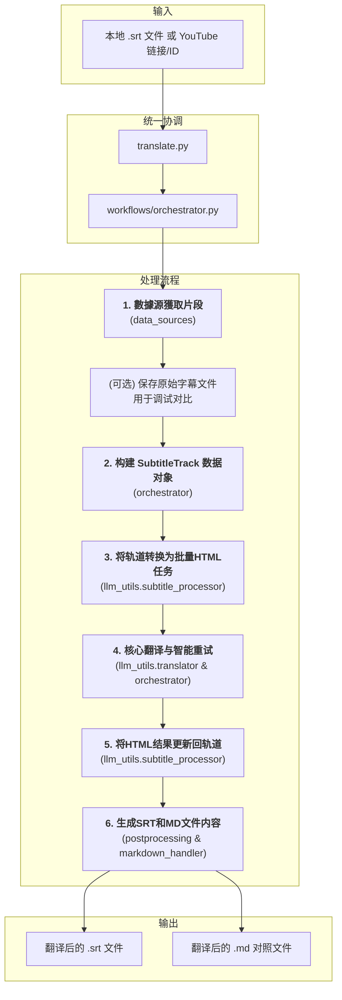

# 文档: 统一字幕翻译工作流

本文档详细描述了 `MultiMediaGenAI` 项目中用于翻译字幕的统一工作流，支持本地字幕文件（目前主要为 `.srt`）和 YouTube 视频字幕。

- **执行入口**: `translate.py` (统一入口点)
- **核心目标**: 输入一个本地 `.srt` 文件路径或 YouTube 视频链接/ID，输出翻译后的、经过优化排版的字幕文件（`.srt` 和 `.md` 格式）。
- **核心数据结构**: `format_converters.book_schema.SubtitleTrack`

---

## 工作流架构

此工作流由 `run_translation.py` 作为统一入口点启动，并由 `workflows/orchestrator.py` 协调整个翻译过程。它围绕一个中心数据结构 `SubtitleTrack` 展开，使用 HTML 作为与大语言模型（LLM）交换数据的格式，以确保元数据（如时间戳）的无损传递。

---

## 数据流转与核心数据结构

整个翻译工作流的核心是 `format_converters.book_schema.SubtitleTrack` 对象。所有数据在不同阶段都围绕此对象进行转换和更新。

-   **输入阶段**: 原始字幕数据（无论是来自本地SRT文件还是YouTube API）首先被解析成一个标准化的片段列表（`list[dict]`），其中每个字典代表一个字幕片段，包含 `text`, `start`, `end` 等信息。
-   **保存原始文件 (新增)**: 在处理之前，系统会将从数据源获取的原始字幕片段保存为一个独立的 `.srt` 文件，存放于输出目录的 `source` 子文件夹下。这为后续的调试、效果对比和问题追溯提供了宝贵的依据。
-   **数据建模**: 这些片段被用于实例化 `SubtitleTrack` 对象。`SubtitleTrack` 内部维护一个 `segments` 列表，每个元素是 `SubtitleSegment` 对象，包含了原文、时间戳、ID等信息。
-   **LLM交互**: 为了与LLM进行高效且无损的交互，`SubtitleTrack` 中的 `SubtitleSegment` 对象会被序列化成带有 `data-id` 等元数据属性的HTML字符串。LLM接收并翻译这些HTML，返回翻译后的HTML字符串。
-   **结果应用**: LLM返回的翻译HTML会被解析，并根据 `data-id` 精确地更新回 `SubtitleTrack` 对象中对应 `SubtitleSegment` 的 `translated_text` 字段。这是一个"就地更新"的过程，确保了数据的一致性。
-   **输出阶段**: 最终，完整的 `SubtitleTrack` 对象被用于生成翻译后的 `.srt` 文件和 `.md` 对照文件。

---

## 模块化步骤详解

### 1. 数据源獲取片段 (Data Source Segment Retrieval)

-   **主控脚本**: `workflows/orchestrator.py`
-   **任务与职责**: 这是工作流的数据输入和准备阶段。`orchestrator` 根据输入类型（本地文件或 YouTube URL）选择相应的 `DataSource`（`LocalFileSource` 或 `YouTubeSource`），并调用其 `get_segments()` 方法来獲取字幕片段。
-   **新增步骤：保存原始文件**: 获取片段后，`orchestrator` 会立刻调用 `format_converters.srt_handler.segments_to_srt_string` 将原始片段转换为SRT格式的字符串，并将其保存到输出目录的 `source` 子文件夹中，文件名类似于 `..._original_en.srt`。

#### 1.1 本地文件字幕获取 (Local File Subtitle Retrieval)

-   **核心模塊**: `data_sources.local_file_source.LocalFileSource`
-   **核心函數**: `LocalFileSource.get_segments()`
-   **詳細說明**: `LocalFileSource` 內部負責：
    1.  **文件解析**: 調用 `format_converters.srt_handler.srt_to_segments`，使用 `pysrt` 庫將本地的 `.srt` 文件內容解析成標準的片段列表。
    2.  **智能合併**: 將解析出的片段列表傳遞給 `format_converters.preprocessing.merge_segments_intelligently` 函數。此函數通過分析標點和節奏，將零散的字幕片段合併成更完整、更適合翻譯的句子。
-   **輸出**: 一個經過合併優化的、適合翻譯的片段列表 (`list[dict]`)。

#### 1.2 YouTube 视频字幕获取 (YouTube Video Subtitle Retrieval)

-   **核心模塊**: `data_sources.youtube_source.YouTubeSource`
-   **核心函數**: `YouTubeSource.get_segments()`
-   **詳細說明**: `YouTubeSource` 內部負責：
    1.  **獲取原始字幕**: 調用 `youtube_utils.data_fetcher.fetch_and_prepare_transcript`。該函數使用 `youtube_transcript_api` 庫與 YouTube 進行交互，根據 `config.py` 中定義的語言偏好 (`PREFERRED_TRANSCRIPT_LANGUAGES`)，優先嘗試獲取手動上傳的、質量更高的字幕，如果找不到，再降級獲取自動生成的字幕。
    2.  **智能合併片段**: 獲取到原始的、通常比較零碎的字幕片段後，此函數會立即將其傳遞給 `format_converters.preprocessing.merge_segments_intelligently` 進行預處理。
-   **輸出**: 一個經過清理和優化的字幕片段列表（`merged_transcript_data`），為下一步的結構化建模做好了準備。

### 2. 构建 SubtitleTrack 数据对象 (Data Modeling)

-   **主控脚本**: `workflows/orchestrator.py`
-   **核心数据结构**: `format_converters.book_schema.SubtitleTrack`
-   **任务与职责**: 此步骤由 `orchestrator` 執行，將無格式的片段列表轉換為標準化的、強類型的数据对象。
    1.  **实例化 `SubtitleTrack`**: `orchestrator` 會創建一個 `SubtitleTrack` 对象，通過 `SubtitleTrack.from_segments` 類方法從數據源獲取的片段數據構建。
-   **核心價值**: 這一步是統一工作流的關鍵。通過將數據統一到 `SubtitleTrack` 這個"單一事實來源"中，後續所有操作都圍繞此對象進行，實現了與YouTube工作流在邏輯層面的完全統一。

### 3. 创建翻译任务 (Task Creation)

-   **主控脚本**: `workflows/orchestrator.py`
-   **核心函数**: `llm_utils.subtitle_processor.subtitle_track_to_html_tasks(...)`
-   **任务与职责**: 此步驟由 `orchestrator` 調用，直接復用了為YouTube工作流開發的核心邏輯。
    1.  **智能分批與HTML格式化**: 該函數接收 `SubtitleTrack` 對象，根據Token限制將所有片段智能地劃分為多個批次。在分批時，每個片段的原文都被序列化為一段帶有 `data-id` 等元數據屬性的HTML，確保LLM在翻譯時不會破壞這些關鍵信息。
-   **輸出**: 一個 "翻譯任務" 列表，其中每一項都包含了準備發往LLM的HTML字符串。

### 4. 核心翻译与智能重试 (Core Translation & Intelligent Retry)

-   **主控脚本**: `workflows/orchestrator.py`
-   **核心模块与函数**:
    -   `workflows/orchestrator.py`:
        -   `_handle_translation_retries()`: 实现工作流层面的智能重试（硬/软错误处理）。
        -   `_is_repeated_text()`: 识别硬错误的辅助函数，包含对重复字符和`[...]`格式的检查。
    -   `llm_utils/translator.py`:
        -   `execute_translation_async()`: 协调并发API调用。
        -   `_call_gemini_api_async()`: 实现API调用层面的指数退避重试。
    -   `prompts.json`:
        -   `html_subtitle_system_prompt`: 包含新的"安全规则"以引导LLM行为。

這個階段是整個工作流最核心、最複雜的部分，它包含兩層重試機制和主動的Prompt引導，以確保翻譯的高成功率和高质量。

#### 4.1 Prompt工程：主動引導與"安全出口"

為了從根源上解決LLM在面對複雜或有歧義的輸入時可能產生的重複、無意義輸出（如"我我我我我..."），系統在構建API請求時，為 `html_subtitle_system_prompt` 注入了明確的**安全規則**。

-   **核心指令**: `Under no circumstances should you repeat words or phrases... Instead, you MUST return the original, untranslated English text enclosed in square brackets, for example: [Original untranslated English text].`
-   **目的**: 這條指令為LLM提供了一個"安全出口"。當它無法準確翻譯某個片段時，它被引導去返回一個特定格式 `[...]` 的、可被代碼識別的標記，而不是陷入錯誤狀態。

#### 4.2 API調用層面的重試

-   **位置**: `llm_utils/translator.py` 內部的 `_call_gemini_api_async`。
-   **觸發條件**: `genai.APIError` (API返回錯誤) 或 `asyncio.TimeoutError` (網絡超時)。
-   **機制**: 這是一個底層的、針對瞬時網絡或API故障的保護機制。當遇到這類錯誤時，它會採用指數退避策略，自動進行最多5次的重試。

#### 4.3 工作流層面的智能重試

這是更高層次的、針對翻譯內容質量的重試機制，由 `orchestrator.py` 中的 `_handle_translation_retries` 私有方法實現。在每一輪批量翻譯結束後，它會啟動一輪"質檢-返工"流程。

1.  **錯誤分類 (質檢)**:
    -   系統會遍歷所有片段，並使用 `_is_repeated_text` 函數進行檢查。
    -   **硬錯誤 (Hard Errors)**: 如果一個片段的譯文包含重複字符模式（如 `我我我...`）或符合LLM返回的安全出口格式（如 `[...]`），它被分類為"硬錯誤"。這通常意味著該片段是導致翻譯失敗的"毒丸"。
    -   **軟錯誤 (Soft Errors)**: 如果一個片段僅僅是沒有譯文或被標記為通用失敗，它被分類為"軟錯誤"，很可能是被"硬錯誤"連帶的"無辜受害者"。

2.  **分而治之 (返工)**:
    -   **處理軟錯誤**: 所有被歸為"軟錯誤"的片段會被重新打包成新的批量任務，進行高效的**批量重試**。
    -   **處理硬錯誤**: 所有被歸為"硬錯誤"的片段，會被**逐個、單獨地**發送給LLM進行重試。這種"隔離"處理方式能有效定位問題，並避免它再次污染其他片段。

3.  **循環與終止**: 這個"質檢-返工"的循環會進行最多3輪。如果在任何一輪結束後，所有片段都已成功翻譯，則循環提前終止。這套機制確保了系統能從內容層面的錯誤中恢復，極大地提升了最終翻譯結果的质量和完整性。

### 5. 應用翻譯結果 (Result Application)

-   **主控脚本**: `workflows/orchestrator.py`
-   **核心模块**: `llm_utils/subtitle_processor.py`
    -   **核心函数**: `update_track_from_html_response(track, translated_html, logger)`
-   **任務與職責**:
    1.  **循環處理**: `orchestrator` 遍歷上一步返回的翻譯結果列表。對於每一個批次的翻譯結果（一個HTML字符串），它都會調用 `update_track_from_html_response`。
    2.  **HTML 精確解析**: 函數內部使用 `BeautifulSoup` 庫來解析LLM返回的HTML。它會查找所有 `
` 標籤。
    3.  **數據就地更新**: 對於每個解析出的 `div`，它會提取出 `data-id` 屬性，並根據這個ID在原始的 `SubtitleTrack` 對象的 `segments` 列表中找到對應的 `SubtitleSegment`。然後，它提取 `
` 標籤內的譯文，並將其賦值給該 `SubtitleSegment` 對象的 `translated_text` 字段。這個過程是"就地更新"，直接修改了內存中的 `SubtitleTrack` 對象。
-   **結果**: 在這個步驟完成後，中心的 `SubtitleTrack` 對象現在已經是一個完整的数据體，同時包含了所有片段的原文和精準匹配的譯文。

### 6. 後處理與生成 (Postprocessing & Generation)

-   **主控脚本**: `workflows/orchestrator.py`
    -   在 `orchestrator` 的 `run` 函數中執行。
-   **核心模块 1**: `format_converters/postprocessing.py`
    -   **核心函数**: `generate_post_processed_srt(subtitle_track, logger)`
    -   **任務與職責**: 此函數的目標是生成一個高質量、符合播放器標準的SRT文件。它接收完整的 `SubtitleTrack` 對象，然後調用 `post_process_translated_segments`。這個後處理器會進行精細的二次處理：根據譯文的標點（如句號、逗號、破折號）和長度，對原有的字幕片段進行再次拆分或合併，並重新計算時間碼，以確保字幕的顯示節奏和斷行都盡可能自然、易讀。最後，它調用 `srt_handler.segments_to_srt_string` 生成最終的SRT文件內容。
-   **核心模块 2**: `format_converters/markdown_handler.py`
    -   **核心函数**: `reconstruct_translated_markdown(subtitle_track, target_lang, logger)`
    -   **任務與職責**: 此函數也接收同一個 `SubtitleTrack` 對象。它的任務是生成一個雙語對照的Markdown文件，用於人工校對。它會遍歷所有片段，將每個片段的時間戳、原文和譯文格式化成清晰的、一一對應的形式。
-   **文件寫入**: `orchestrator` 中的 `save_to_file` 工具函數負責將這兩個核心函數返回的字符串內容分別寫入對應的 `.srt` 和 `.md` 文件中，完成整個工作流。

**關鍵內部函數:**
- `_process_one_segment_hybrid(...)`: 後處理的核心，採用混合策略。它首先按對話符 `-` 進行分割，對分割後的部分平均分配時間；然後對每個部分再按標點符號進行更細的分割，並按比例分配時間。
- `_wrap_text(...)`: 負責將一行過長的文本，根據字符數限制和標點符號，智能地換行成多行，以符合字幕的顯示標準。
- `segments_to_srt_string(...)` (來自 `srt_handler`): 在所有處理完成後，調用此函數將最終的片段列表轉換成標準SRT文件格式的字符串。
