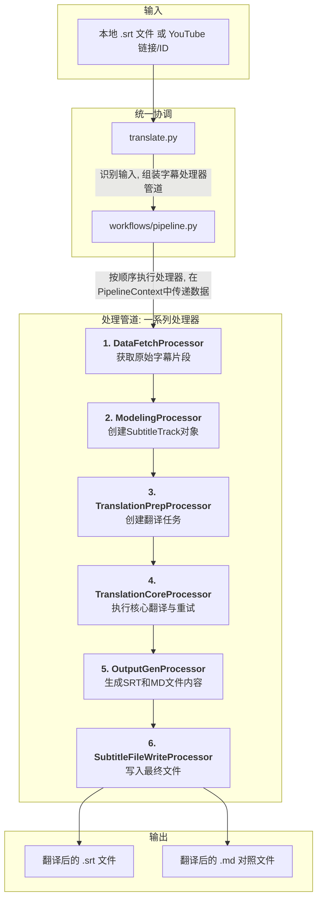

# 文档: 统一字幕翻译工作流

本文档详细描述了 `MultiMediaGenAI` 项目中用于翻译字幕的统一工作流，支持本地字幕文件（如 `.srt`) 和 YouTube 视频字幕。

- **执行入口**: `translate.py` (统一入口点)
- **核心架构**: 基于"管道-处理器"模式 (`Pipeline-Processor`)
- **核心目标**: 输入一个本地 `.srt` 文件路径或 YouTube 视频链接/ID，输出翻译后的、经过优化排版的字幕文件（`.srt` 和 `.md` 格式）。
- **核心数据结构**: `format_converters.book_schema.SubtitleTrack` (在 `PipelineContext` 中传递)

---

## 工作流架构

此工作流由 `translate.py` 作为统一入口点启动，并由 `workflows/pipeline.py` 协调整个翻译过程。它围绕一个中心数据载体 `PipelineContext` 展开，该上下文携带一个 `SubtitleTrack` 数据对象，在管道中的一系列处理器之间流转。

---

## 数据流转与核心数据结构

整个翻译工作流的核心数据载体是 `workflows.dto.PipelineContext` 对象。所有数据和状态都在这个上下文中，由不同的处理器进行创建、转换和更新。

-   **初始化**: `translate.py` 脚本接收命令行参数，并创建一个 `PipelineContext` 实例，填入初始信息如 `source_input` (文件路径或URL), `target_lang` 等。
-   **数据获取 (`DataFetchProcessor`)**: 此处理器根据 `source_input` 的类型（本地文件或YouTube URL），获取原始字幕片段，并将片段列表（`list[dict]`）存入上下文的 `raw_segments` 字段。
-   **数据建模 (`ModelingProcessor`)**: 此处理器读取 `raw_segments`，将其构建成一个强类型的 `SubtitleTrack` 对象，并存入上下文的 `subtitle_track` 字段。这是将不同来源的数据统一化的关键步骤。
-   **翻译任务准备 (`TranslationPrepProcessor`)**: 此处理器读取 `subtitle_track`，将其智能分批并序列化为带有 `data-id` 等元数据的HTML字符串，最后将生成的"翻译任务"列表存入 `translation_tasks` 字段。
-   **核心翻译 (`TranslationCoreProcessor`)**: 此处理器读取 `translation_tasks`，调用LLM进行翻译。它内部实现了强大的并发控制和重试机制（包括API层面和内容层面的错误处理），并将翻译结果（HTML字符串）存入 `translated_results` 字段。
-   **输出内容生成 (`OutputGenProcessor`)**: 此处理器读取 `subtitle_track` 和 `translated_results`。它首先将翻译结果HTML解析并精确更新回 `subtitle_track` 对象中。然后，它调用后处理逻辑，生成最终的SRT和Markdown文件内容，并分别存入 `final_srt_content` 和 `final_md_content` (假设字段存在) 字段。
-   **文件写入 (`SubtitleFileWriteProcessor`)**: 这是管道的最后一步。它从上下文中读取最终的SRT和Markdown内容，以及 `output_dir` 等元数据，将它们写入到文件系统中，完成整个工作流。

---

## 模块化处理器详解

### 1. `DataFetchProcessor`

- **核心职责**: 根据输入源（本地文件或YouTube）获取标准化的原始字幕片段。
- **输入 (来自 `PipelineContext`)**: `source_input`。
- **输出 (写入 `PipelineContext`)**: `raw_segments` (`list[dict]`), `source_lang`, `source_metadata`。

**任务与逻辑**:
- **路由**: 判断 `source_input` 是本地文件路径还是YouTube URL。
- **本地文件**: 如果是文件路径，则调用 `srt_handler.srt_to_segments` 解析文件，然后使用 `preprocessing.merge_segments_intelligently` 将零散的字幕片段合并成更适合翻译的句子。
- **YouTube**: 如果是URL，则调用 `youtube_utils.data_fetcher` 获取字幕，同样调用 `preprocessing.merge_segments_intelligently`进行智能合并。
- **输出**: 最终，将处理好的片段列表、源语言和元数据存入上下文。

**关键内部实现**:
- `data_sources.local_file_source.LocalFileSource`: 处理本地文件输入。
- `data_sources.youtube_source.YouTubeSource`: 处理YouTube链接输入。
- `format_converters.preprocessing.merge_segments_intelligently`: 两种数据源获取原始片段后，都会调用此函数来优化字幕分段，使其更符合自然语言的句子结构。

### 2. `ModelingProcessor`

- **核心职责**: 将无格式的片段列表转换为标准化的 `SubtitleTrack` 数据对象。
- **输入 (来自 `PipelineContext`)**: `raw_segments`。
- **输出 (写入 `PipelineContext`)**: `subtitle_track` (`SubtitleTrack` 对象)。

**任务与逻辑**:
1.  此处理器是统一工作流的关键。它接收 `DataFetchProcessor` 产生的、已经过预处理的 `raw_segments`。
2.  通过 `SubtitleTrack.from_segments` 类方法，将这些片段数据实例化为一个 `SubtitleTrack` 对象。
3.  **核心价值**: 通过将数据统一到 `SubtitleTrack` 这个"单一事实来源"中，后续所有处理器都可以围绕此标准对象进行操作，实现了与输入源无关的、统一的后续处理逻辑。

**关键内部实现**:
- `format_converters.book_schema.SubtitleTrack.from_segments`: 处理器主要调用此 `SubtitleTrack` 的类方法，将原始的字典列表转换为强类型的 `SubtitleTrack` 对象。

### 3. `TranslationPrepProcessor`

- **核心职责**: 将 `SubtitleTrack` 对象转换为适合LLM处理的批量HTML任务。
- **输入 (来自 `PipelineContext`)**: `subtitle_track`。
- **输出 (写入 `PipelineContext`)**: `translation_tasks` (`list[dict]`)。

**任务与逻辑**:
1.  接收 `ModelingProcessor` 创建的 `SubtitleTrack` 对象。
2.  根据Token限制将所有片段智能地划分为多个批次。
3.  在分批时，每个片段的原文都被序列化为一段带有多层嵌套和 `data-id` 等元数据属性的HTML，确保LLM在翻译时不会破坏时间戳等关键信息。
4.  输出一个 "翻译任务" 列表，其中每一项都包含了准备发往LLM的HTML字符串。

**关键内部实现**:
- `llm_utils.subtitle_processor.subtitle_track_to_html_tasks`: 处理器直接调用此核心函数，该函数封装了将 `SubtitleTrack` 对象转换为批量HTML翻译任务的全部逻辑。

### 4. `TranslationCoreProcessor`

- **核心职责**: 执行核心翻译，并内置强大的、多层次的重试机制。
- **输入 (来自 `PipelineContext`)**: `translation_tasks`。
- **输出 (写入 `PipelineContext`)**: `translated_results` (`list[str]`)。

**任务与逻辑**:
这是整个工作流最核心、最复杂的处理器之一，它确保了翻译的高成功率和高质量。

1.  **Prompt工程**: 在构建API请求时，会为System Prompt注入明确的**安全规则**，指导LLM在无法翻译时返回一个特定格式 `[...]` 的、可被代码识别的标记，而不是陷入重复输出等错误状态。
2.  **API调用层面的重试**: 内部的API调用函数 `_call_gemini_api_async` 实现了指数退避重试，以处理瞬时的网络或API故障。
3.  **工作流层面的智能重试**: 在批量翻译结束后，处理器会启动一轮"质检-返工"流程。
    -   **错误分类**: 检查返回结果中是否有硬错误（如 `我我我...` 的重复文本或 `[...]` 标记）和软错误（其他失败）。
    -   **分而治之**: 将软错误重新打包进行**批量重试**，将硬错误**逐个、隔离地**进行重试，以避免"毒丸"片段污染其他任务。
    -   此循环最多进行3轮，极大地提升了最终翻译结果的质量和完整性。

**关键内部实现**:
- `llm_utils.translator.execute_translation_async`: 用于执行初翻和所有重试中的API调用。
- `llm_utils.subtitle_processor.update_track_from_html_response`: 在收到翻译结果后，调用此函数将HTML格式的译文解析并更新回 `SubtitleTrack` 对象中。
- `_handle_retries_internal`: 处理器内部的一个私有异步方法，完整地实现了包含"质检-返工"逻辑的工作流层面重试。

### 5. `OutputGenProcessor`

- **核心职责**: 应用翻译结果，并进行后处理，生成最终的文件内容。
- **输入 (来自 `PipelineContext`)**: `subtitle_track`, `translated_results`。
- **输出 (写入 `PipelineContext`)**: `final_srt_content` (`str`), `final_md_content` (`str`)。

**任务与逻辑**:
1.  **应用结果**: 遍历 `translated_results`，调用 `subtitle_processor.update_track_from_html_response`，使用 `BeautifulSoup` 解析LLM返回的HTML，并根据 `data-id` 将译文精确地更新回 `subtitle_track` 对象中。
2.  **生成SRT**: 将更新后的 `subtitle_track` 传给 `postprocessing.generate_post_processed_srt`。此函数会根据译文的标点和长度，对字幕片段进行再次拆分或合并，并重新计算时间码，以优化显示节奏和断行，最终生成SRT文件字符串。
3.  **生成Markdown**: 将同一个 `subtitle_track` 传给 `markdown_handler.reconstruct_translated_markdown`，生成一个用于人工校对的双语对照Markdown文件字符串。
4.  将生成的两个字符串存入上下文，供最后一个处理器使用。

**关键内部实现**:
- `format_converters.postprocessing.generate_post_processed_srt`: 处理器调用此核心函数。该函数内部实现了复杂的后处理逻辑，如根据译文标点和长度重新拆分/合并字幕并计算时间码，以优化最终SRT文件的可读性。
- `format_converters.markdown_handler.reconstruct_translated_markdown`: (如果需要生成MD文件) 调用此函数来生成双语对照的Markdown文件内容。

### 6. `SubtitleFileWriteProcessor`

- **核心职责**: 将内存中的文件内容写入到磁盘。
- **输入 (来自 `PipelineContext`)**: `final_srt_content`, `final_md_content`, `output_dir`, `source_metadata`。
- **输出**: 在文件系统生成最终的 `.srt` 和 `.md` 文件。

**任务与逻辑**:
1.  这是管道的终点。它从上下文中读取 `OutputGenProcessor` 生成的最终文件内容。
2.  根据 `output_dir` 和 `source_metadata`（例如视频标题或原始文件名）构建最终的输出路径和文件名。
3.  将SRT和Markdown字符串内容写入到对应的文件中，完成整个工作流。

**关键内部实现**:
- `common_utils.output_manager.OutputManager`: 用于创建和管理具体任务的输出目录结构。
- `OutputManager.save_file`: 调用此方法执行最终的文件写入操作。
