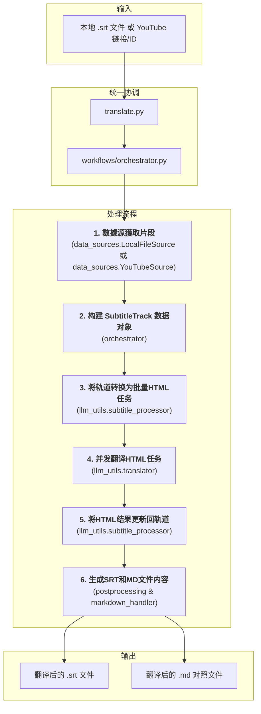

# 文档: 统一字幕翻译工作流

本文档详细描述了 `MultiMediaGenAI` 项目中用于翻译字幕的统一工作流，支持本地字幕文件（目前主要为 `.srt`）和 YouTube 视频字幕。

- **执行入口**: `translate.py` (统一入口点)
- **核心目标**: 输入一个本地 `.srt` 文件路径或 YouTube 视频链接/ID，输出翻译后的、经过优化排版的字幕文件（`.srt` 和 `.md` 格式）。
- **核心数据结构**: `format_converters.book_schema.SubtitleTrack`

---

## 工作流架构

此工作流由 `run_translation.py` 作为统一入口点启动，并由 `workflows/orchestrator.py` 协调整个翻译过程。它围绕一个中心数据结构 `SubtitleTrack` 展开，使用 HTML 作为与大语言模型（LLM）交换数据的格式，以确保元数据（如时间戳）的无损传递。

---

## 模块化步骤详解

### 1. 数据源獲取片段 (Data Source Segment Retrieval)

-   **主控脚本**: `workflows/orchestrator.py`
-   **任务与职责**: 这是工作流的数据输入和准备阶段。`orchestrator` 根据输入类型（本地文件或 YouTube URL）选择相应的 `DataSource`（`LocalFileSource` 或 `YouTubeSource`），并调用其 `get_segments()` 方法来獲取字幕片段。

#### 1.1 本地文件字幕获取 (Local File Subtitle Retrieval)

-   **核心模塊**: `data_sources.local_file_source.LocalFileSource`
-   **核心函數**: `LocalFileSource.get_segments()`
-   **詳細說明**: `LocalFileSource` 內部負責：
    1.  **文件解析**: 調用 `format_converters.srt_handler.srt_to_segments`，使用 `pysrt` 庫將本地的 `.srt` 文件內容解析成標準的片段列表。
    2.  **智能合併**: 將解析出的片段列表傳遞給 `format_converters.preprocessing.merge_segments_intelligently` 函數。此函數通過分析標點和節奏，將零散的字幕片段合併成更完整、更適合翻譯的句子。
-   **輸出**: 一個經過合併優化的、適合翻譯的片段列表 (`list[dict]`)。

#### 1.2 YouTube 视频字幕获取 (YouTube Video Subtitle Retrieval)

-   **核心模塊**: `data_sources.youtube_source.YouTubeSource`
-   **核心函數**: `YouTubeSource.get_segments()`
-   **詳細說明**: `YouTubeSource` 內部負責：
    1.  **獲取原始字幕**: 調用 `youtube_utils.data_fetcher.fetch_and_prepare_transcript`。該函數使用 `youtube_transcript_api` 庫與 YouTube 進行交互，根據 `config.py` 中定義的語言偏好 (`PREFERRED_TRANSCRIPT_LANGUAGES`)，優先嘗試獲取手動上傳的、質量更高的字幕，如果找不到，再降級獲取自動生成的字幕。
    2.  **智能合併片段**: 獲取到原始的、通常比較零碎的字幕片段後，此函數會立即將其傳遞給 `format_converters.preprocessing.merge_segments_intelligently` 進行預處理。
-   **輸出**: 一個經過清理和優化的字幕片段列表（`merged_transcript_data`），為下一步的結構化建模做好了準備。

### 2. 构建 SubtitleTrack 数据对象 (Data Modeling)

-   **主控脚本**: `workflows/orchestrator.py`
-   **核心数据结构**: `format_converters.book_schema.SubtitleTrack`
-   **任务与职责**: 此步骤由 `orchestrator` 執行，將無格式的片段列表轉換為標準化的、強類型的数据对象。
    1.  **实例化 `SubtitleTrack`**: `orchestrator` 會創建一個 `SubtitleTrack` 对象，通過 `SubtitleTrack.from_segments` 類方法從數據源獲取的片段數據構建。
-   **核心價值**: 這一步是統一工作流的關鍵。通過將數據統一到 `SubtitleTrack` 這個"單一事實來源"中，後續所有操作都圍繞此對象進行，實現了與YouTube工作流在邏輯層面的完全統一。

### 3. 创建翻译任务 (Task Creation)

-   **主控脚本**: `workflows/orchestrator.py`
-   **核心函数**: `llm_utils.subtitle_processor.subtitle_track_to_html_tasks(...)`
-   **任务与职责**: 此步驟由 `orchestrator` 調用，直接復用了為YouTube工作流開發的核心邏輯。
    1.  **智能分批與HTML格式化**: 該函數接收 `SubtitleTrack` 對象，根據Token限制將所有片段智能地劃分為多個批次。在分批時，每個片段的原文都被序列化為一段帶有 `data-id` 等元數據屬性的HTML，確保LLM在翻譯時不會破壞這些關鍵信息。
-   **輸出**: 一個 "翻譯任務" 列表，其中每一項都包含了準備發往LLM的HTML字符串。

### 4. 核心翻译 (Core Translation)

-   **主控脚本**: `workflows/orchestrator.py`
-   **核心模块**: `llm_utils/translator.py`
    -   **入口函数**: `execute_translation_async(...)`
    -   **核心执行函数**: `Translator.translate_chapters_async(...)`
-   **任務與職責**:
    1.  **並發控制**: `orchestrator` 調用 `execute_translation_async`，該函數首先實例化一個 `Translator` 對象。核心的 `translate_chapters_async` 方法使用 `asyncio.Semaphore` 來創建一個並發任務池，從而能以受控的並發數（例如同時5個）向LLM API發出請求，兼顧了速度與穩定性。
    2.  **Prompt 构建**: 對於每一個任務（HTML批次），它會從 `prompts.json` 加載為字幕翻譯定制的Prompt模板（`html_subtitle_system_prompt` 和 `html_subtitle_user_prompt`），並將HTML內容填入，構建最終的API請求。
    3.  **異步API調用**: `_call_gemini_api_async` 函數負責實際與Google Gemini API的通信。它使用 `await self.model.generate_content_async(...)` 發起異步調用，並設置了超時以防卡死。
    4.  **日誌記錄**: 每次成功的API調用後，LLM返回的原始、未經處理的HTML響應會被記錄到一個 `.jsonl` 日誌文件中，便於調試和問題追溯。
-   **輸出**: 一個包含LLM原始響應（即翻譯後的HTML字符串）的結果列表。

### 5. 应用翻译结果 (Result Application)

-   **主控脚本**: `workflows/orchestrator.py`
-   **核心模块**: `llm_utils/subtitle_processor.py`
    -   **核心函数**: `update_track_from_html_response(track, translated_html, logger)`
-   **任務與職責**:
    1.  **循環處理**: `orchestrator` 遍歷上一步返回的翻譯結果列表。對於每一個批次的翻譯結果（一個HTML字符串），它都會調用 `update_track_from_html_response`。
    2.  **HTML 精確解析**: 函數內部使用 `BeautifulSoup` 庫來解析LLM返回的HTML。它會查找所有 `
` 標籤。
    3.  **數據就地更新**: 對於每個解析出的 `div`，它會提取出 `data-id` 屬性，並根據這個ID在原始的 `SubtitleTrack` 對象的 `segments` 列表中找到對應的 `SubtitleSegment`。然後，它提取 `
` 標籤內的譯文，並將其賦值給該 `SubtitleSegment` 對象的 `translated_text` 字段。這個過程是"就地更新"，直接修改了內存中的 `SubtitleTrack` 對象。
-   **結果**: 在這個步驟完成後，中心的 `SubtitleTrack` 對象現在已經是一個完整的数据體，同時包含了所有片段的原文和精準匹配的譯文。

### 6. 后处理与生成 (Postprocessing & Generation)

-   **主控脚本**: `workflows/orchestrator.py`
    -   在 `orchestrator` 的 `run` 函數中執行。
-   **核心模块 1**: `format_converters/postprocessing.py`
    -   **核心函数**: `generate_post_processed_srt(subtitle_track, logger)`
    -   **任務與職責**: 此函數的目標是生成一個高質量、符合播放器標準的SRT文件。它接收完整的 `SubtitleTrack` 對象，然後調用 `post_process_translated_segments`。這個後處理器會進行精細的二次處理：根據譯文的標點（如句號、逗號、破折號）和長度，對原有的字幕片段進行再次拆分或合併，並重新計算時間碼，以確保字幕的顯示節奏和斷行都盡可能自然、易讀。最後，它調用 `srt_handler.segments_to_srt_string` 生成最終的SRT文件內容。
-   **核心模块 2**: `format_converters/markdown_handler.py`
    -   **核心函数**: `reconstruct_translated_markdown(subtitle_track, target_lang, logger)`
    -   **任務與職責**: 此函數也接收同一個 `SubtitleTrack` 對象。它的任務是生成一個雙語對照的Markdown文件，用於人工校對。它會遍歷所有片段，將每個片段的時間戳、原文和譯文格式化成清晰的、一一對應的形式。
-   **文件写入**: `orchestrator` 中的 `save_to_file` 工具函數負責將這兩個核心函數返回的字符串內容分別寫入對應的 `.srt` 和 `.md` 文件中，完成整個工作流。

**关键内部函数:**
- `_process_one_segment_hybrid(...)`: 后处理的核心，采用混合策略。它首先按对话符 `-` 进行分割，对分割后的部分平均分配时间；然后对每个部分再按标点符号进行更细的分割，并按比例分配时间。
- `_wrap_text(...)`: 负责将一行过长的文本，根据字符数限制和标点符号，智能地换行成多行，以符合字幕的显示标准。
- `segments_to_srt_string(...)` (来自 `srt_handler`): 在所有处理完成后，调用此函数将最终的片段列表转换成标准SRT文件格式的字符串。
